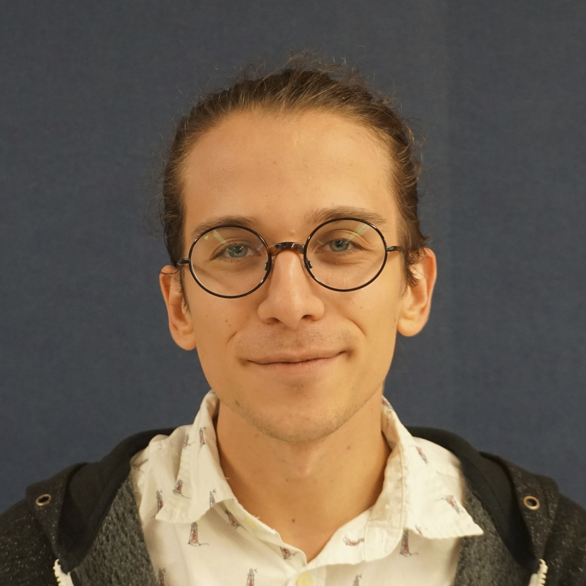

<!-- 1. 1

2. 1

2. 2.5
<embed src="https://github.com/mossti/Portfolio/blob/master/images/myface.jpg">

3. 3

""

4. 4

"" -->

Andrew was first introduced to robotics as a young man, participating in and eventually becoming an officer of his high school’s robotics & design team. He would go on to participate in a wide range of research interests while attending Indiana University, including questions in endocrinology, digital humanities, and (most centrally) the biophysics of vision. Throughout all lines of research, the primary drive was to better understand the differences and similarities between biological and mechanical systems. He graduated from Indiana University in 2017 with a B.S. in Physics and a B.A. in Folklore & Ethnomusicology. Andrew then joined on as lab manager at the de Ruyter Biophysics lab, where he spent a year working on software design for the generation of experimental stimuli as well as for neural recording. The position additionally involved analysis of experimental data as well as the maintenance and development of laboratory resources. 

In the summer of 2018, Andrew departed from Indiana to the distant land of Chicago, Illinois. There, he began as a student in Northwestern's Masters of Science in Robotics (MSR) program, which he graduated from in Fall 2019. Andrew is now a rising 3rd year pursuing a PhD degree in Mechanical Engineering at Northwestern University, where he hopes to further explore the interface between human and artifice. After graduation he intends to enter the field of assistive robotics, with particular interest in computational geometry and low-cost, high-access solutions.

<!-- 1. -->
<!-- https://mossti.github.io/Portfolio/docs/cv.pdf -->

<!-- 2. -->
<a id="raw-url" href="https://github.com/mossti/Portfolio/blob/master/docs/resume_cv_may_2022.pdf">[NOTE] click here to view my C.V.</a>

<!-- 3.
[../docs/cv.pdf](https://github.com/mossti/Portfolio/blob/master/docs/resume_cv_may_2022.pdf) -->

### Research interests
* Assistive Technology and Shared Autonomy
* Biomechanics and Biomimicry
* Prosthetics and Orthotics
* Soft Actuation and Materials
