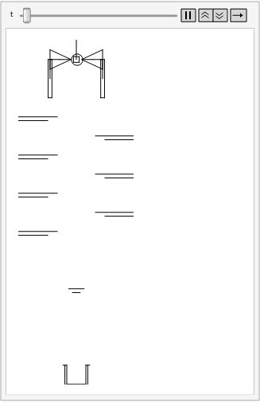
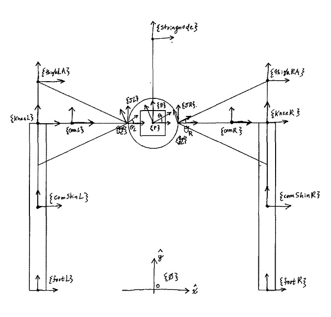

This project was to create a dynamic simulation of a two-legged tumbling robot. In this simulation, the gravity and environmental parameters are meant to model a Martian chasm. The robot itself is on a tensile string, and undergoes plastic impact with the various outcrops on its way down.

This model was inspired by the <a href="https://www.strandbeest.com/" title="Strandbeests of Theo Jansen">Strandbeests of Theo Jansen</a>, which utilize the interplay of environmental forces (e.g., wind, gravity, etc.) and mechanical properties (e.g., springs, pulleys, airfoils, etc.) to effect bio-inspired motion.

<!--  -->

