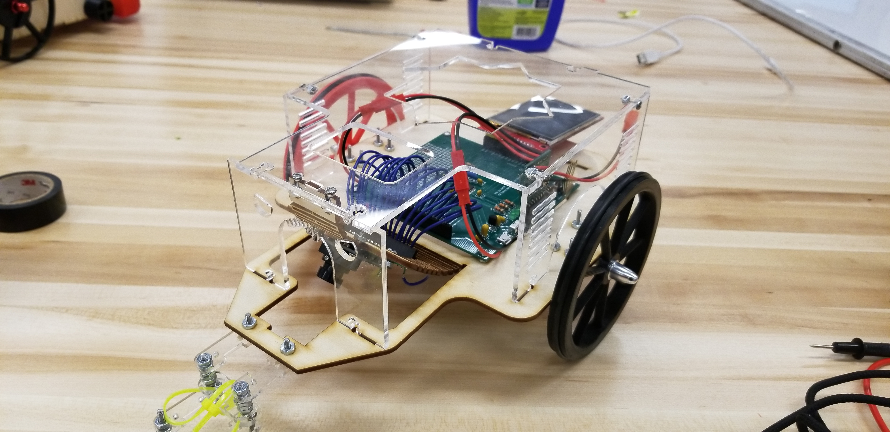

This project involved the creation of a small differential-drive vehicle with embedded visual processing that could follow a drawn line. The vehicle's chassis was assembled by hand via laser-cut components (acrylic and wood) which I designed using <a href="https://inkscape.org/" title="Inkscape">Inkscape</a>.
<!-- [Inkscape](https://inkscape.org/).  -->

### Check it out!
[Link to the Line-Following Vehicle project repository on Github.](https://github.com/mossti/ME433-Advanced-Mechatronics/tree/master/HW16)
