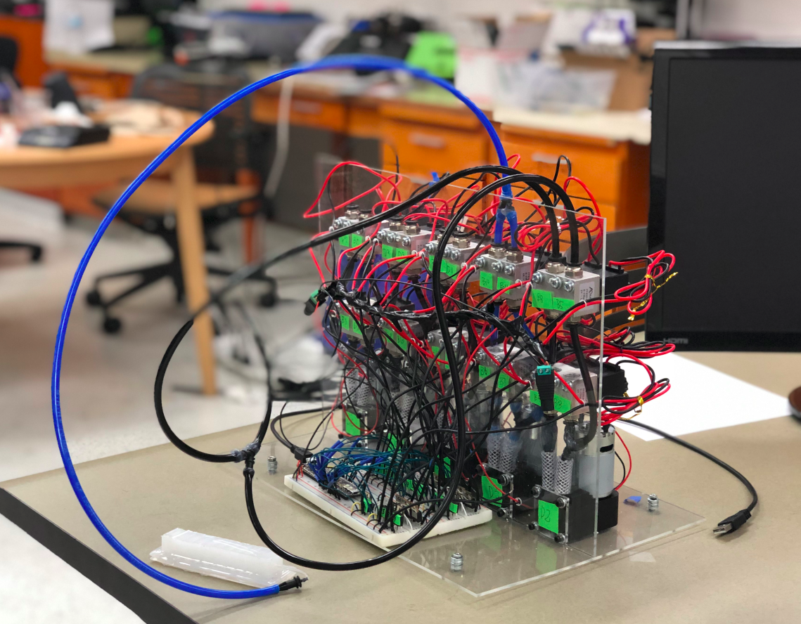

This was an extracurricular project between myself and a few other students in Dr. Mitra Hartmann's 2019 Soft Robotics course. The motivation for designing and building this manifold was to get a better sense of the current state of DIY fluid actuation. We worked without any pre-existing kits, and instead relied on our summed knowledge of circuitry and fluid mechanics. We tested the resultant manifold on a number of fabricated McKibben muscles along with a few novel soft actuators that were designed by students in the aforementioned class. 

The manifold has a network of alternating air channels. On one end, these channels can all be diverted to either a vacuum (negative pressure) or a pump (positive pressure). Diverting the flow (and creating fluid circuits more broadly) is done via a cascading set of solenoid valves. Logic for these valves can be programmed via most forms of electronic circuit (we used a mechanical switch array and eventually a Raspberry Pi for testing) to generate patterned actuation for various soft actuators.