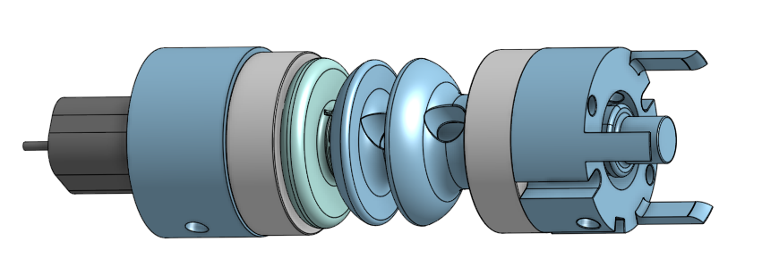
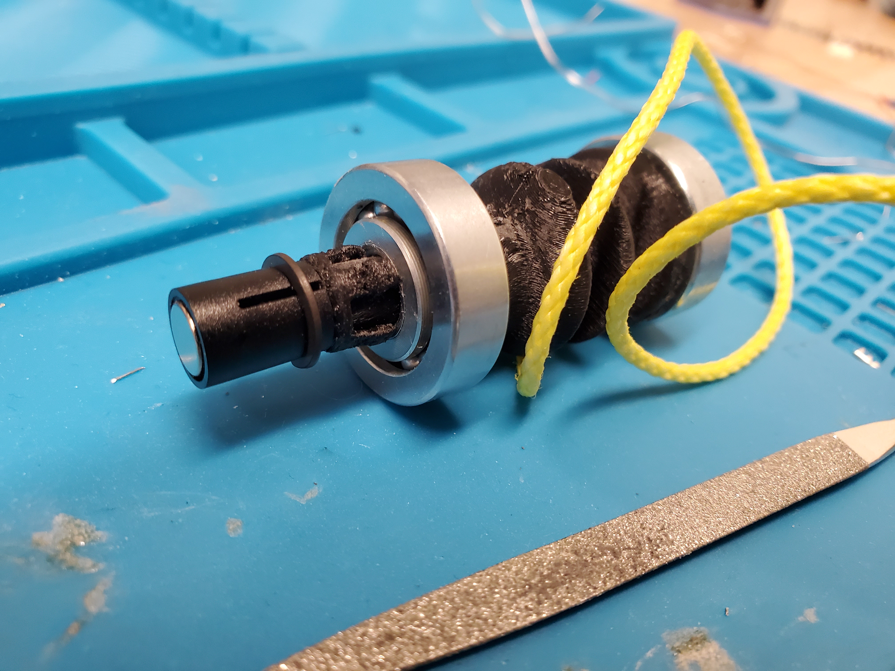
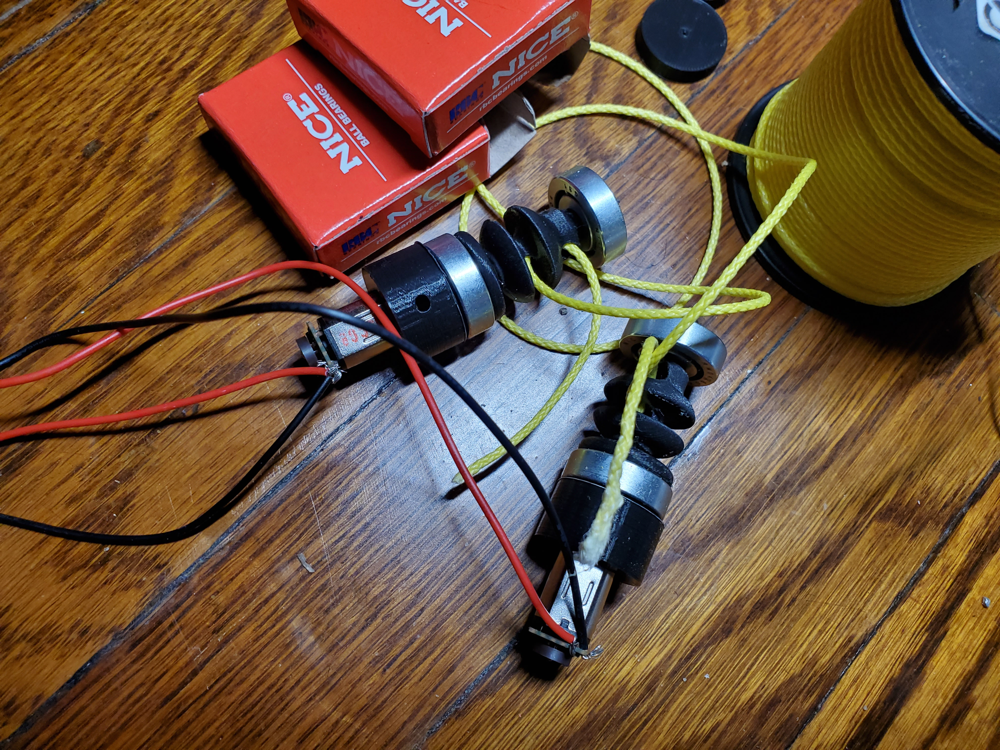
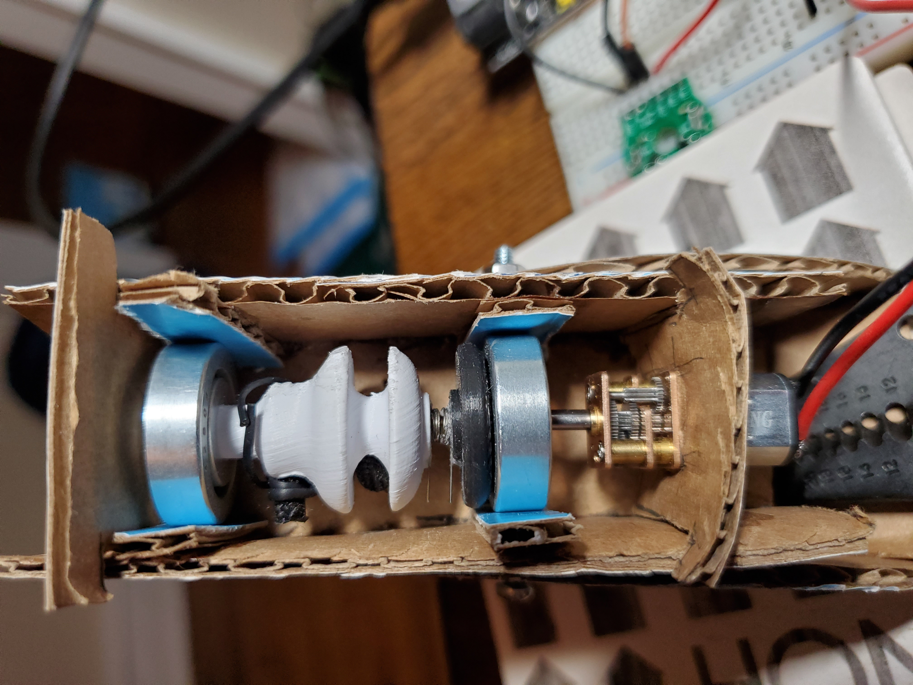
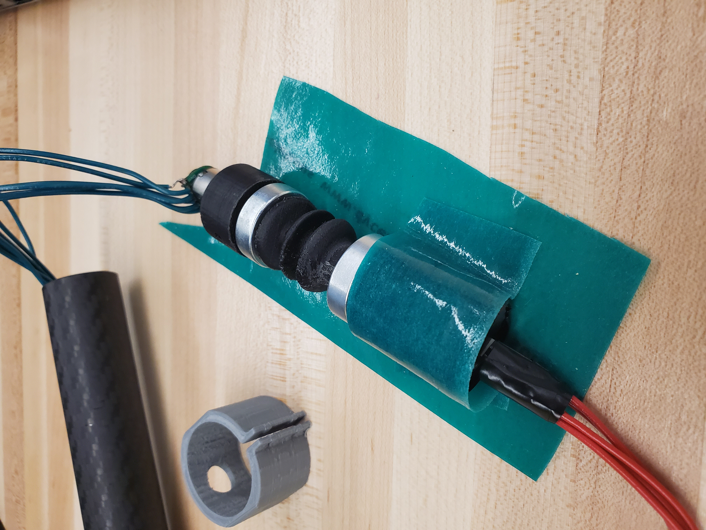
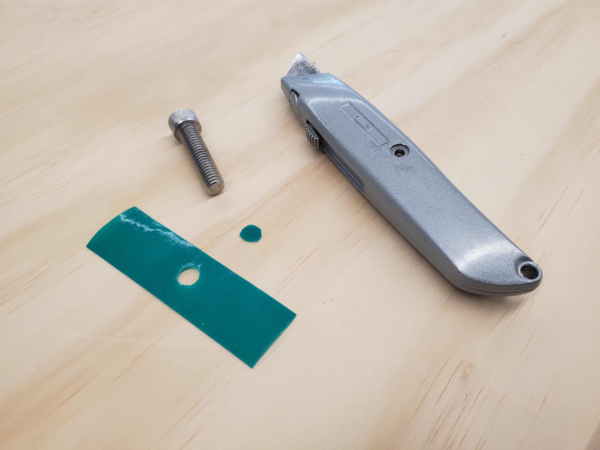
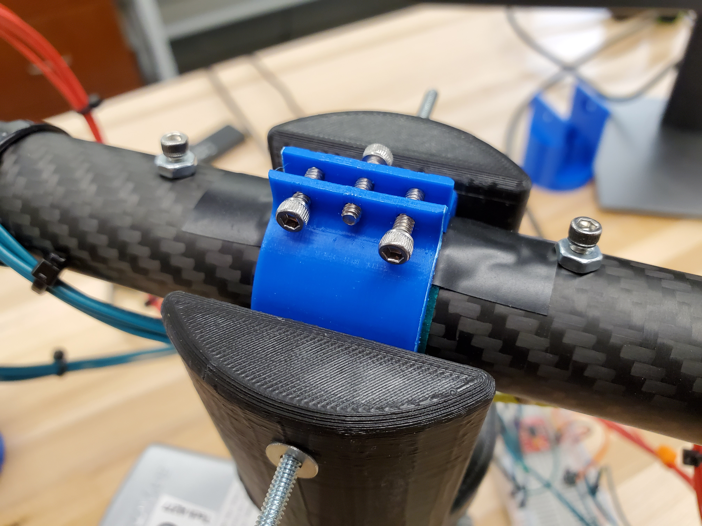
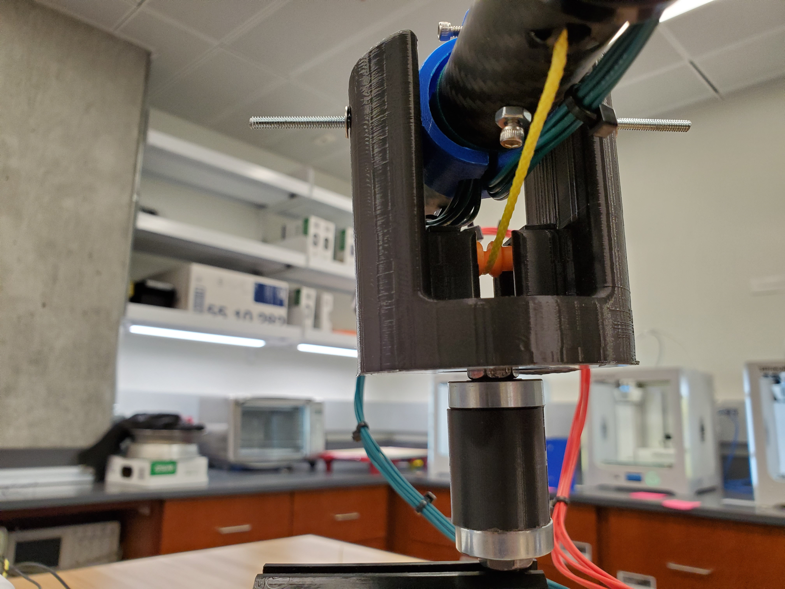
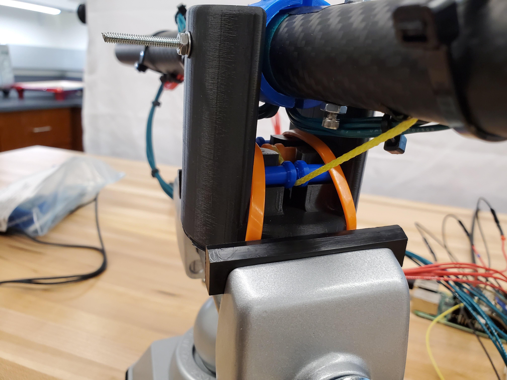
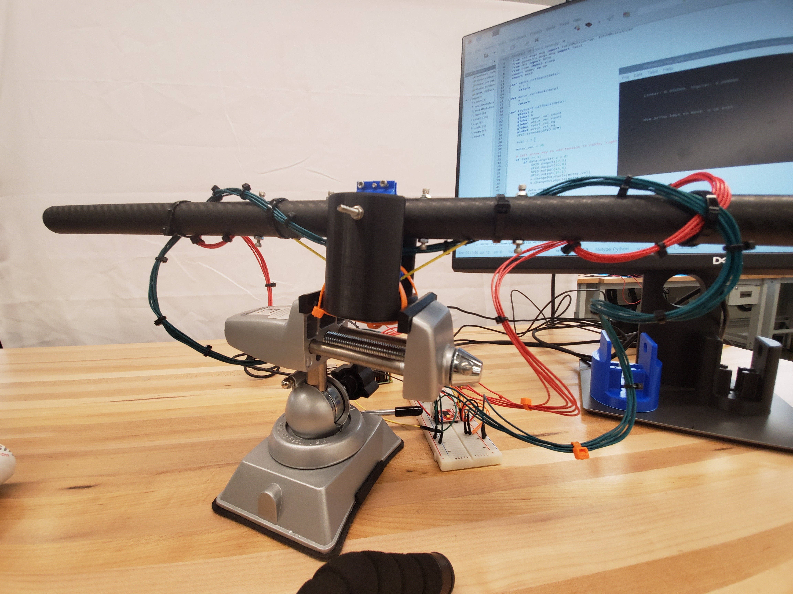

This project was completed as my final project for the Masters of Science in Robotics program at Northwestern University, under the guidance of Dr. Felix Huang and Dr. Matt Elwin (MSR program director). The goal was to design a compliant actuator which could be used in as a component in a rigid, rehabilitative exoskeleton. I ended up focusing on two key technologies in the design of this actuator: (1) series elastic actuation and (2) cable-driven actuation, both of which are employed regularly within the domain of rehabilitative and assistive robotics. Cables (under tension) wrap around two 3D-printed spools which face one another inside of a carbon fiber tube. The spools are fit with rotary encoders as well as rotary motors. There is a torsion spring connecting the two spools, and counts from the encoder are tracked to reflect the pressure on the spring at any given time. Embedded logic drives the motors to try to minimize pressure on the spring, which enables the joint to be compliant yet self-corrective (eg., if the motors have additional logic to help motivate training/rehabilitation exercises on the wearer, these actuators will not force the wearer to move; rather, they will push against the user and use that encoder feedback to reduce strain on the system as a whole).

<!-- <iframe src="https://www.youtube.com/watch?v=A_MqyhAG-6s" width="640" height="360" frameborder="0" allow="accelerometer; autoplay; encrypted-media; gyroscope; picture-in-picture" allowfullscreen>
</iframe> -->
<!-- 

    

        <video controls width="640">
            <video src="{{site.baseurl}}/videos/MSR_2019_SEA_exo.mp4" data-canonical-src="{{site.baseurl}}/videos/MSR_2019_SEA_exo.mp4" control="controls" type=video/mp4>
        </video>
    

 -->

<!-- 

    <video controls width="640">
        <source src="{{site.baseurl}}/videos/MSR_2019_SEA_exo.mp4" type=video/mp4>
    </video>

 -->

<video class="center" src="{{site.baseurl}}/videos/MSR_2019_SEA_exo.mp4" data-canonical-src="{{site.baseurl}}/videos/MSR_2019_SEA_exo.mp4" controls="controls" style="max-height:640px;">

</video>

Won't play in browser? No problem! See the video on its host site [here!](https://www.youtube.com/watch?v=A_MqyhAG-6s)

    
    
    
    
    
    
    
    
    

### Check it out!
[Link to the SEA project repository on Github.](https://github.com/mossti/exo_rendering)
