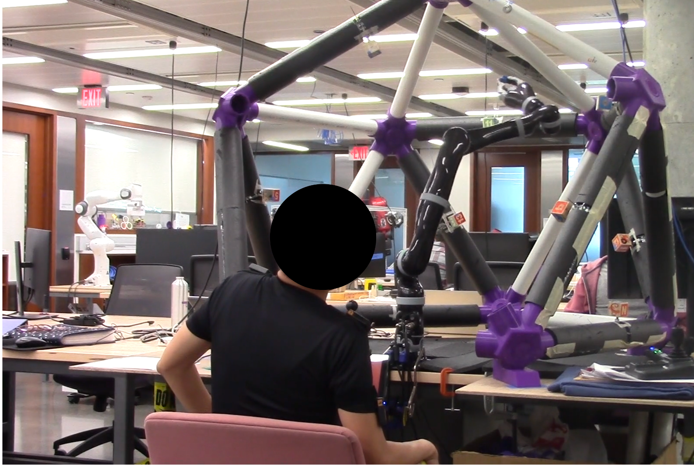

I designed this piece of experimental hardware over Summer 2021 to contribute to an ongoing study in our research group. The design objective was for a cage that allowed for center-out reaching tasks using a teleoperated robotic arm; these joints could be arranged in a modular fashion (to accomodate the relatively small 3D printer we had access to) without sacrificing structural integrity. The tubing is standard PVC, and targets may be arranged with regularly available plumbing fixtures to any point along the tubing or to the joints themselves.

In the image above, a participant operates our lab's Jaco 7-DOF arm using a wearable sensor array, with the task of moving the arm's end-effector ("hand") to different points along the inside of the cage. You can see that the PVC has been reinforced with foam padding in some regions due to the potential for collision from the robot arm.