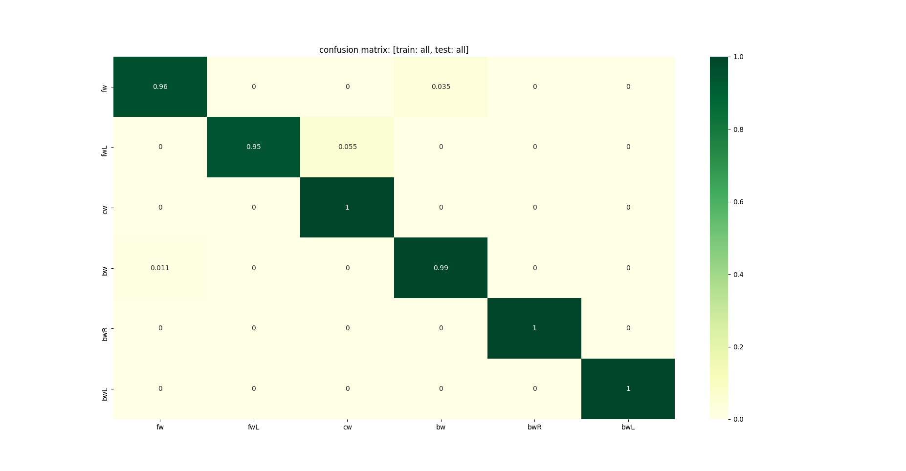

This project reflects a pilot study conducted solely on control subjects which was an early attempt to integrate with computational geometry principles with interface classification. In this project, users would operate a 2D virtual robot using the arrow keys to reach a series of goals in the environment. The paths that participants traced were then normalized, batched, and used as supervised training data for an RNN (Recursive Neural Network), with the eventual goal of real-time classification of different categories of small paths ("motion primitives"). Alongside the newly collected paths, existent data from prior studies from our lab involving SCI (Spinal-Cord Injured) participants was also used for training a RNN. 

Three separate networks were trained: (1) control data only, (2) SCI data only, (3) both control and SCI data. As shown in the first picture (above), collections of paths across users could be interpreted as similar within an 'envelope' of variation---and typically this variation was more pronounced in SCI participants, reflecting various degrees of neuromotor impairment. As shown in the second picture, the network employed proved robust enough to this variation, classifying well above 95% of the test set's trajectories correctly.

