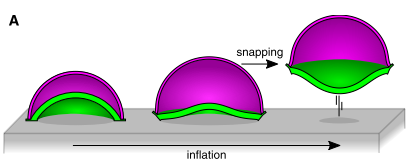
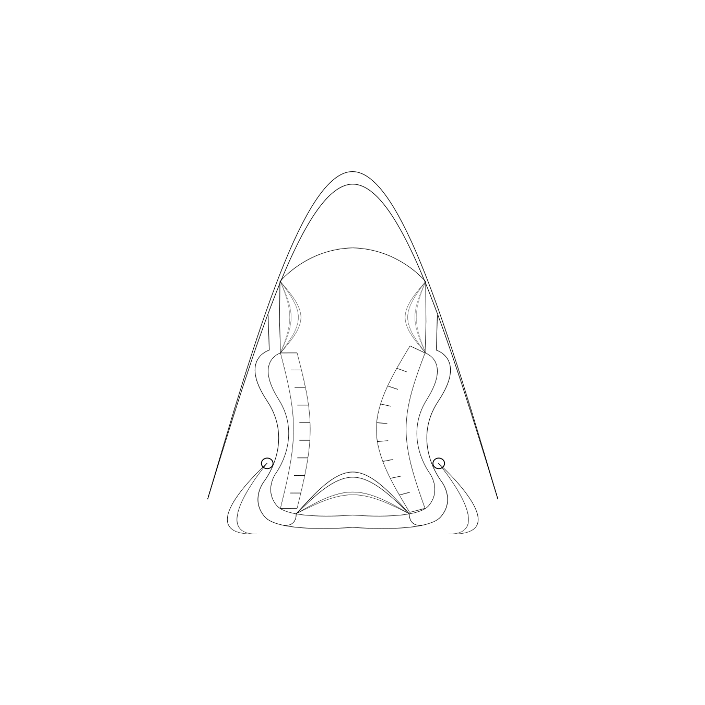
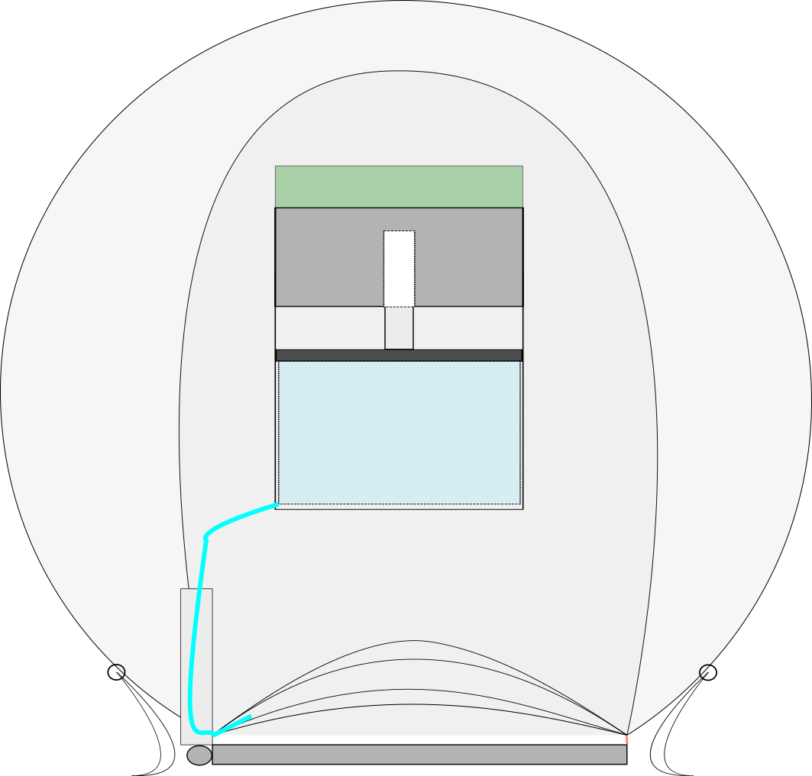
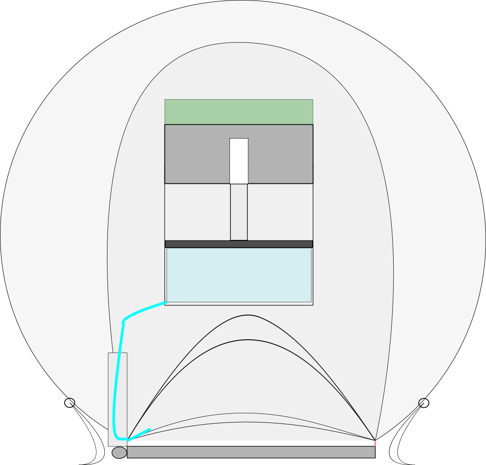
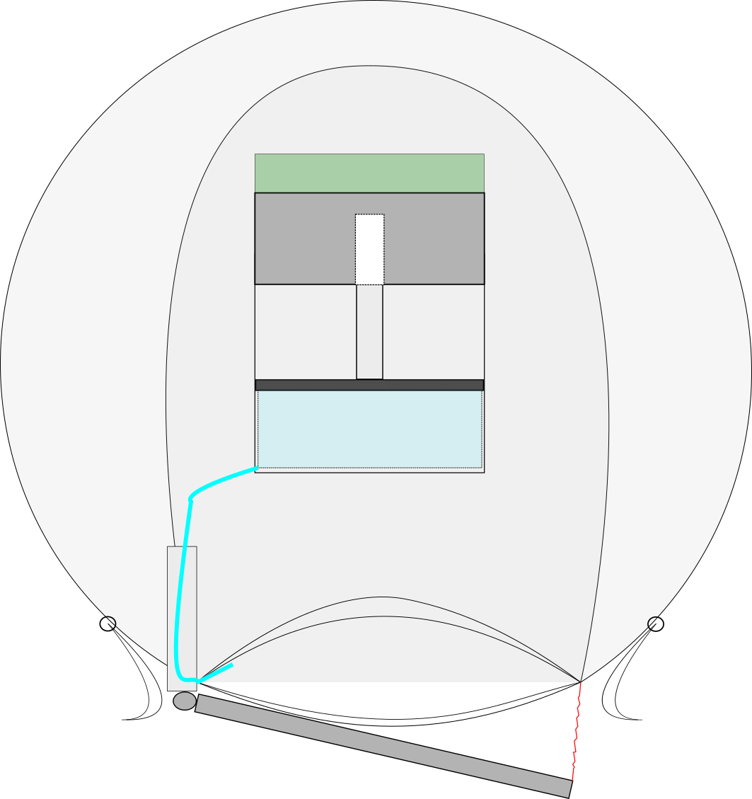
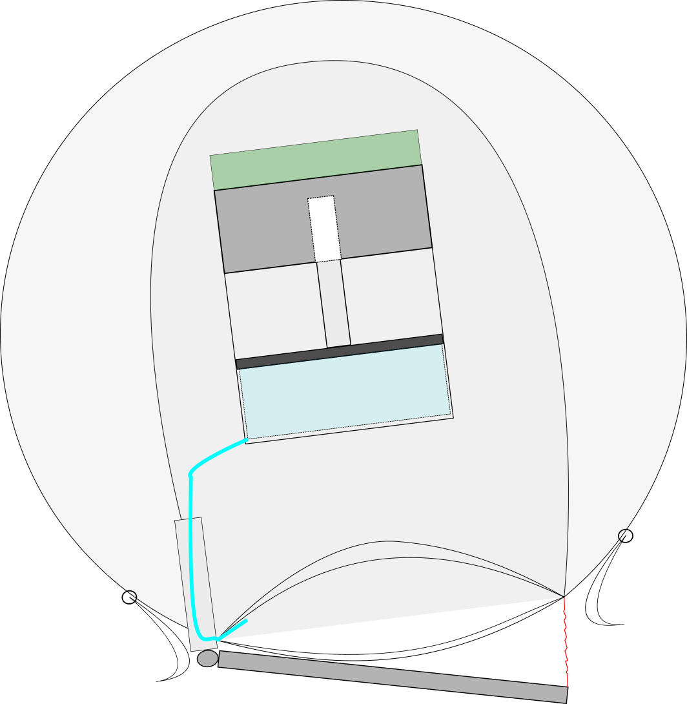
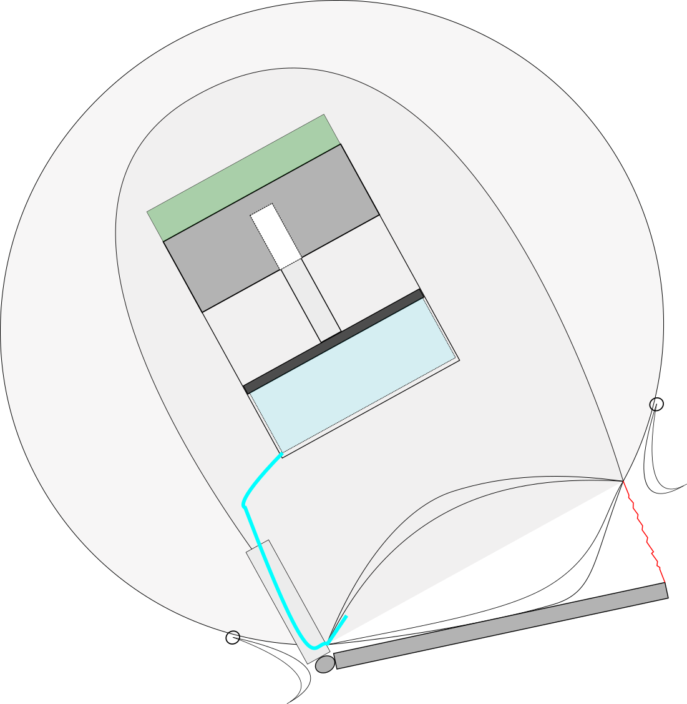
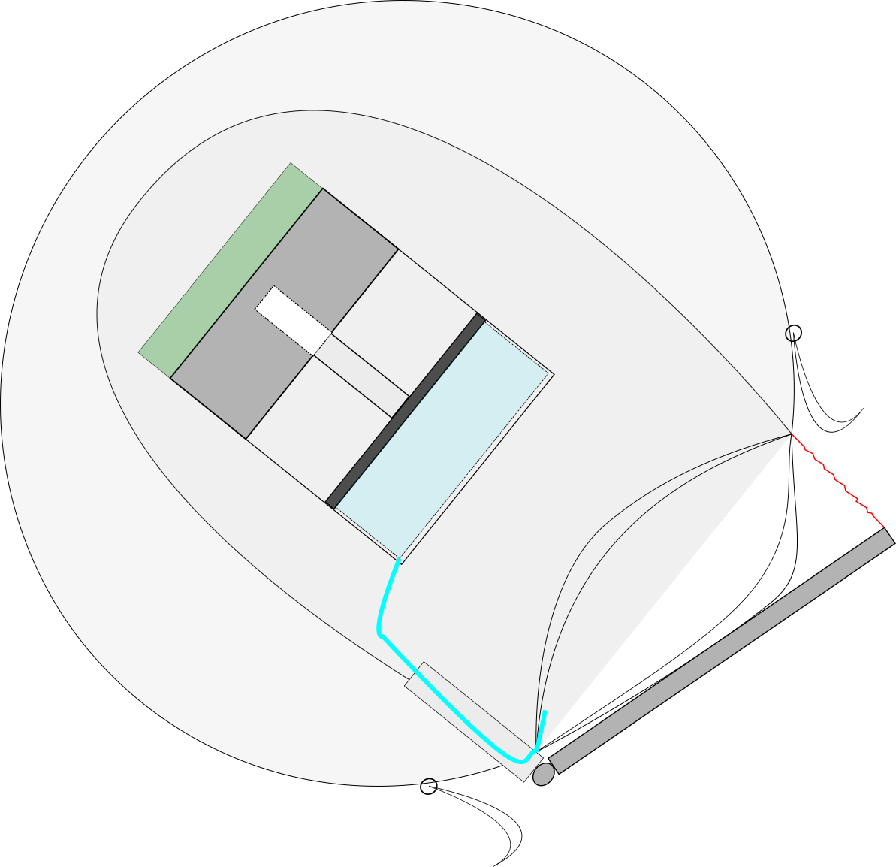
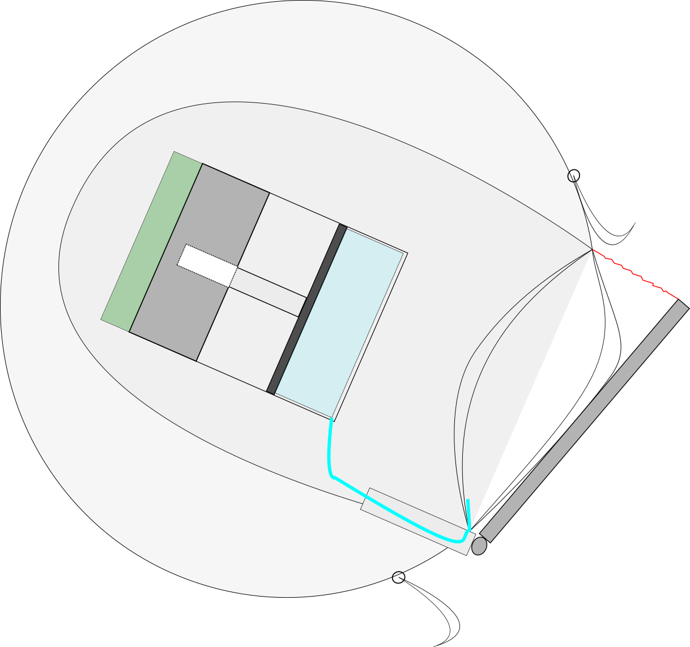
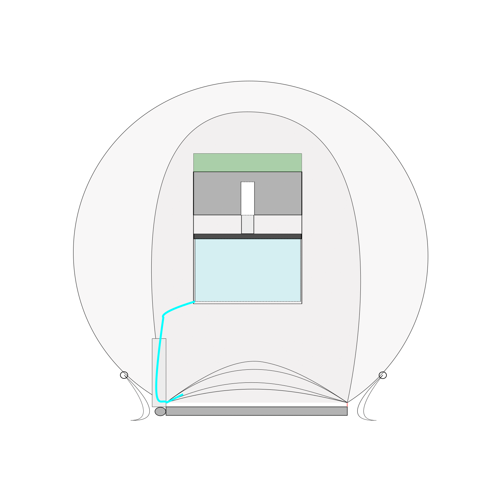

I animated these two designs for a project in the course "Signals and Sensing"; the goal was to design (in two-person groups) a novel actuation method based on pre-existing actuation methods in biology. Our group (classmate <a href="https://www.linkedin.com/in/ermyntrude-adjei-90a204142" title="Adjei LinkedIn Profile">Ermyntrude Adjei</a> and myself) focused on the explosive jumping mechanism found in the leg structure of grasshoppers, locusts, and other Acrididae. Both designs utilize isochoric snappers---a current trend in compliant actuation research that involves using the energy released via the (mechanical) snap-through buckling of certain plastic membranes. 
<!-- Isochoric snappers may be more familiar than they seem---perhaps recognizable as the half-spherical toys that bounce into the air when inverted and placed on a flat surface. -->

See more details of the proposed designs in <a id="raw-url" href="https://github.com/mossti/Portfolio/blob/master/docs/soft_jumping_actuator.pdf">this slide-deck</a>!

#### Design 1: "The Rocket"
This design is almost entirely ballistic, and utilizes internal soft actuators to help control the dynamics.

    

        <!-- 
        
        
        
         -->
        
        
        
        
        
    

    

#### Design 2: "The Orb"
This design is meant to roll and bounce with directional control afforded only by the manipulation of the 'foot' (which serves as an intermediate impact surface). 

    

        <!-- 
        
        
        
        
        
        
         -->
        
        
        
        
        
        
        
        
    

    

