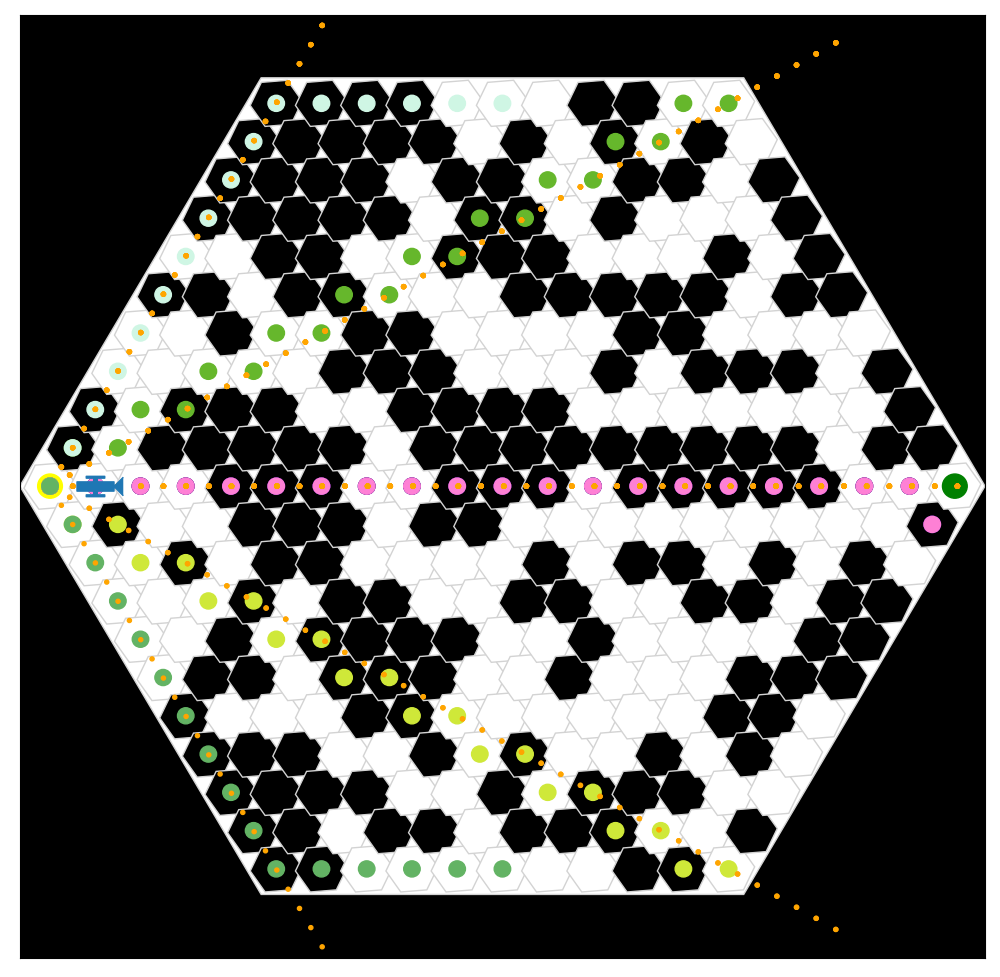
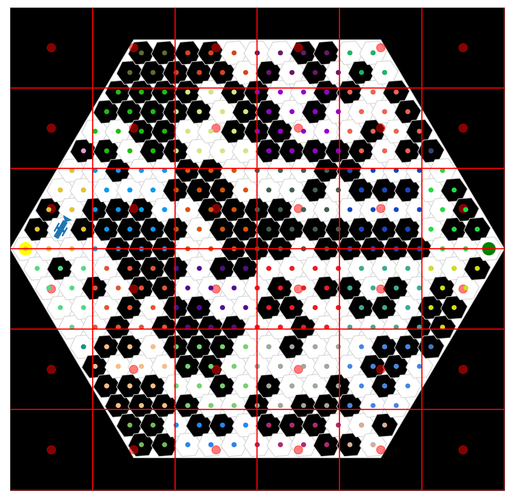
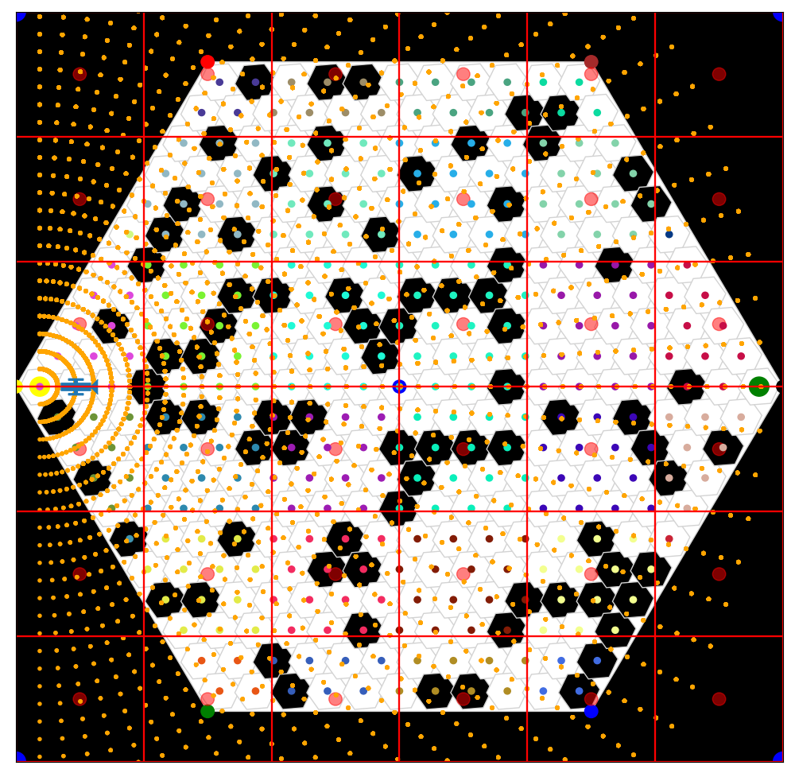
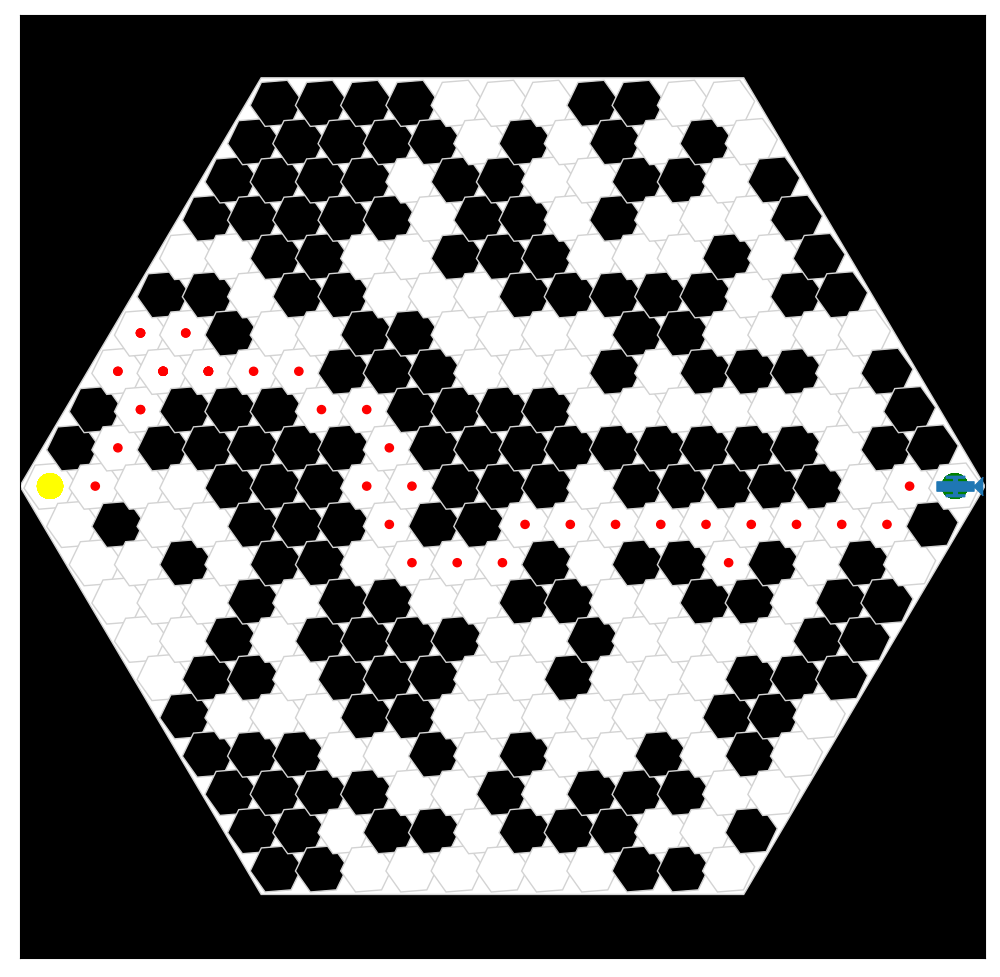

This project was completed as part of Dr. Malcolm MacIver's course, "Computational Neuromechanics and Neuroethology", where we were tasked on an individual basis to expand upon a codebase actively used by his [research group](https://maciverlab.github.io/). This codebase's intent is to model predator/prey interactions using intelligent, autonomous agents in simulation. One focus of the course---and of the research which his group has already published---is the effect of environmental density on agent behaviors. I decided to try and apply a handful of navigation techniques to the agent to see if I could optimize the agent's path-length within the context of a novel, potentially dangerous, and variationally dense environment.

    
    **[TOP LEFT]** the use of ray-tracing to check for local features of the environment. **[TOP RIGHT]** the use of spatial binning ("patches") to keep discovered environmental features within memory in an efficient manner. **[BOTTOM LEFT]** simultaneous ray-tracing and spatial binning (sRTSB). **[BOTTOM RIGHT]** Optimized SLAM within a heavily occluded environment (using sRTSB).
    
    
    

See more details of my algorithmic approach in <a id="raw-url" href="https://github.com/mossti/Portfolio/blob/master/docs/thompson_asn11_bme468.pdf">this slide-deck</a>!