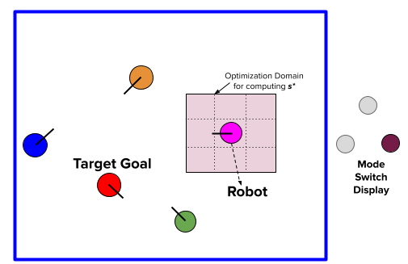
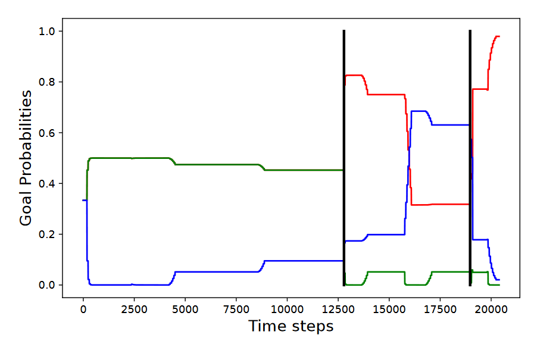
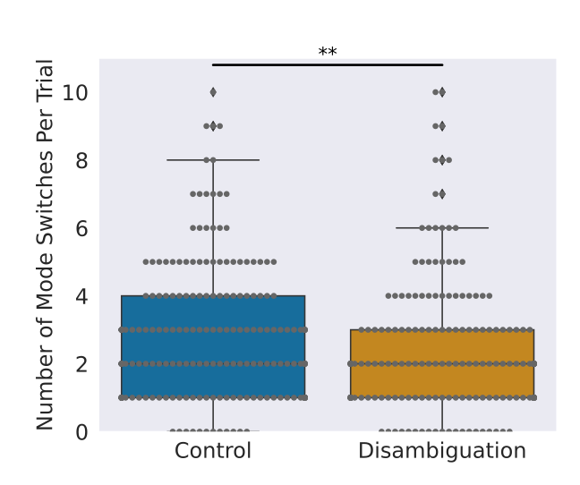
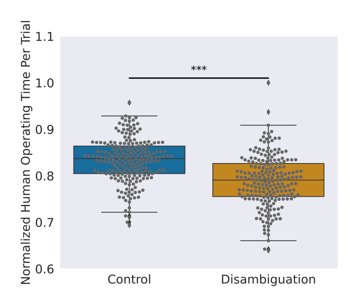

# Contextual Nudging for Intent Disambiguation in Assistive Shared Autonomy

**Information-theoretic shared control to reduce user cognitive load in ambiguous task environments**  
*Deepak Gopinath (First Author), Andrew Thompson (Second Author), Brenna Argall Lab*

---

## Overview

This project introduced a real-time shared autonomy controller that uses **information-theoretic reasoning** to detect and resolve user intent ambiguity during assistive robotic teleoperation. The system proactively suggests control directions by nudging the robot toward **states with high expected information gain**—thereby accelerating disambiguation while preserving user control authority.

The system was deployed on a Kinova Gen2 robotic arm and tested in simulated and physical scenarios. It served as a foundation for developing more interpretable, user-centered shared control frameworks in assistive contexts.

---

## Motivation

- In shared autonomy, user intent can be **ambiguous**, particularly when goal targets are similar or when input is noisy.
- Traditional approaches rely on full goal prediction, which introduces latency or instability.
- Our system instead prioritizes **action selection that reduces intent uncertainty**, inspired by concepts from active learning and information theory.

---

## System Design

### Mutual Information-Based Nudging

- System maintains a **belief distribution over candidate goals**.
- At each timestep, it evaluates candidate control actions using:
  - **Expected information gain**: how much an action would clarify user intent
  - **Task progress**: how much it moves toward all goals
- Selected actions are **blended** with user input using a confidence-weighted arbitration scheme.

### Core Components

- **Intent Belief Module**: Bayesian update based on observed user inputs  
- **Action Evaluator**: Computes MI between actions and goals  
- **Control Arbitration Layer**: Blends human and nudge commands  
- **ROS Integration**: Deployed with Kinova Gen2 arm in real-time loop

---

## Experiments

- **Environment**: Discrete and continuous goal layouts (3–8 possible targets)  
- **Users**: 8 participants, including motor-impaired individuals  
- **Conditions**:  
  - No nudging (baseline)  
  - Confidence threshold-based switching  
  - Mutual information nudging

### Metrics

- Task completion time  
- Time to disambiguation  
- User override frequency  
- Subjective workload (NASA-TLX)

---

## Key Results

- Nudging led to **faster disambiguation** and more confident goal selection compared to baseline and threshold switching.
- Participants retained high control authority and reported **lower subjective workload**.
- System improved transparency by **guiding users subtly** without enforcing hard switches.
- Demonstrated feasibility of using real-time **mutual information optimization** for shared control in physical systems.

---

## Publication

> Algorithmic Foundations of Robotics (WAFR), 2022  
> **Information-Theoretic Intent Disambiguation via Contextual Nudges for Assistive Shared Control**  
> *Deepak Gopinath, Andrew Thompson, Brenna Argall*  
<!-- > [Link to publication if available] -->

---

## Access

- ROS and Python-based implementation in private lab repository.  
- Evaluation scripts and simulation data available upon request.  
- Code written for compatibility with Kinova Gen2 ROS driver and teleop pipeline.

---
