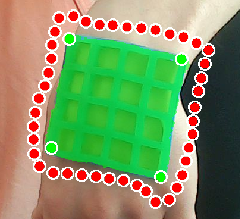
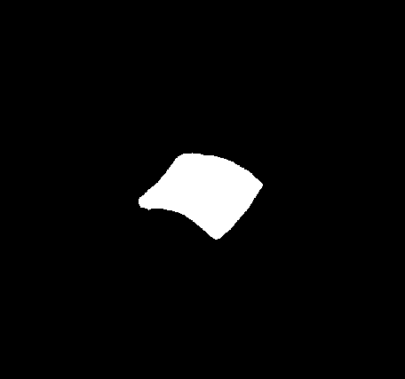
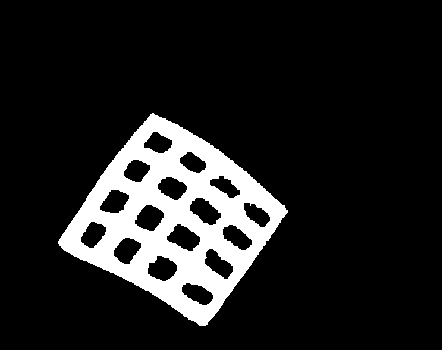
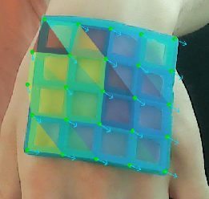
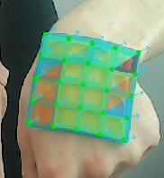
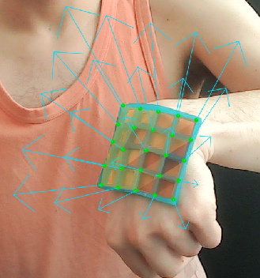

**A monocular CV system that tracks elastic deformation of a 4×4 flexible silicone lattice adhered to skin, separating per-node elastic displacement from rigid-body limb motion to infer subsurface muscle activity, at 30 fps, using a single USB webcam and no contact instrumentation.**  
*Andrew Thompson*

---

<video class="center" src="{{site.baseurl}}/videos/lattice_demo.mp4" autoplay loop muted playsinline style="max-height:640px;"></video>

## Motivation

A flexible lattice adhered to skin deforms visibly as underlying muscles contract and relax. Tracking this deformation with a standard webcam gives a dense, spatially-resolved strain field that can be correlated with specific muscle groups, without gel, wiring, or clinical hardware.

The core challenge is separating *elastic* deformation (strain from muscle activity) from *rigid-body* motion (the limb translating or rotating as a whole). Both show up as node displacement in image space; the tracker solves this decomposition each frame using an ARAP deformation model and a projective rigid-body subtraction step.

## Physical Setup

| Parameter | Value |
|---|---|
| Lattice material | Teal/cyan silicone (EcoFlex 00-30) |
| Grid | 4×4 cells, 5×5 intersection nodes |
| Cell pitch | 15.0 mm (12.5 mm hole + 2.5 mm bar) |
| Camera | USB webcam, 1280x720, 30 fps |
| Depth sensor | None |

## Status

This is an active, ongoing personal research project, not tied to any lab or employer. The system runs in real time on a standard webcam at 30 fps and produces per-node displacement and per-triangle strain/stress estimates suitable for downstream gesture classification, control mapping, or biomechanical analysis.

## Technical Deep-Dive: Architecture, Math, and Engineering Challenges

### System Architecture

Five ROS 2 nodes communicate via typed messages. The tracker processes every camera frame at 30 fps; the SAM2 segmenter publishes masks asynchronously at 3-7 fps.

| Stage | Node | Output topic |
|---|---|---|
| 1. SAM2 segmentation | `lattice_segmenter_node.py` | `/lattice_mask` |
| 2. H-initialisation from mask hull | `deformation_tracker_arap_node` | internal |
| 3. Cell centroid detection | ↑ | internal |
| 4. KLT optical flow reconciliation | ↑ | internal |
| 5. ARAP deformation solve | ↑ | internal |
| 6. Rigid-body subtraction | ↑ | `/deformation_field_arap` |
| 7. Strain & stress computation | ↑ | `/deformation_field_arap` |
| Diagnostics | ↑ | `/tracker_diagnostics_arap` |

### Stage 1 — SAM2 Lattice Segmentation

Meta SAM2's VideoPredictor (Ravi et al., 2024) is initialised from a single user click on the lattice. The model propagates a binary mask frame-to-frame without further input, and resets every 30 frames to prevent GPU memory accumulation, carrying forward the most-recent mask as the next session's prompt.

The mask has two uses downstream: it provides the convex hull from which $$H_\text{snap}$$ is estimated each frame, and it gates centroid detection so that skin texture outside the lattice is never accepted as a lattice cell.

*One-click SAM2 initialisation. The model encodes the lattice boundary (red contour) from a single prompt point; green markers indicate the four hull corners extracted for homography estimation.*

*The propagated lattice mask in a later frame, tracked automatically from the single initial click with no further user input.*

### Stage 2-4 — Detection

**Cell centroid detection.** The Lab $$a^*$$ channel is extracted, enhanced with CLAHE (Zuiderveld, 1994), and thresholded via Otsu's method (Otsu, 1979), which selects the threshold $$t$$ that maximizes between-class variance:

$$
t^* = \arg\max_t\ \omega_0(t)\ \omega_1(t)\ [\mu_0(t)-\mu_1(t)]^2
$$

where $$\omega_0,\omega_1$$ are the background/foreground pixel-fraction weights and $$\mu_0,\mu_1$$ their respective mean intensities. Connected component analysis on the inverted (hole) mask yields one centroid per open cell, computed from each region's image moments:

$$
\bar x = \frac{M_{10}}{M_{00}}, \qquad \bar y = \frac{M_{01}}{M_{00}}
$$

Node positions are derived from adjacent-cell centroid midpoints along the dominant horizontal and vertical basis vectors $$\hat{h}$$, $$\hat{v}$$.

*Otsu thresholding of the Lab $$a^*$$ channel inside the SAM2 mask. White regions are lattice bars; open cells appear as black holes. Connected component analysis on this mask yields one centroid per cell.*

**KLT reconciliation.** Pyramidal Lucas-Kanade optical flow runs on raw grayscale, not CLAHE, which violates brightness-constancy across frames. The reconciliation rule: if centroid and KLT agree within `max_refine_dist`, centroid wins; if they disagree, KLT wins; if both fail, the node is marked invalid and ARAP interpolates.

### Stage 5 — ARAP Deformation Tracking

The lattice is modelled as a graph $$G = (V, E)$$ of 25 intersection nodes. Let $$\mathbf{r}_i \in \mathbb{R}^2$$ be the captured rest position of node $$i$$ and $$\mathbf{s}_i \in \mathbb{R}^2$$ its current position. The As-Rigid-As-Possible (ARAP) energy (Sorkine & Alexa, 2007) minimised each frame is:

$$
E_\text{ARAP} = \sum_i \sum_{j \in \mathcal{N}(i)} w_{ij} \left\| (\mathbf{s}_i - \mathbf{s}_j) - R_i(\mathbf{r}_i - \mathbf{r}_j) \right\|^2
$$

where $$R_i \in SO(2)$$ is the best local rotation at node $$i$$, found by alternating local and global steps.

#### Local step — per-node rotation via SVD

With current positions fixed, the optimal rotation at each node minimises the local rigidity energy. This has the closed-form solution:

$$
C_i = \sum_{j \in \mathcal{N}(i)} w_{ij} (\mathbf{s}_i - \mathbf{s}_j)(\mathbf{r}_i - \mathbf{r}_j)^T = U \Sigma V^T \qquad \Rightarrow \qquad R_i = VU^T
$$

#### Global step — sparse linear system

With rotations fixed, adding observation constraints (weight $$\lambda_i$$) and Tikhonov regularisation to $$E_\text{ARAP}$$ and minimising over all node positions gives the linear system:

$$
(L + \Lambda) \mathbf{s} = \mathbf{b}
$$

where $$L$$ is the graph Laplacian, and $$\Lambda = \mathrm{diag}(\lambda_i)$$ with:

$$
\lambda_i = \begin{cases} \lambda_\text{obs} & \text{node } i \text{ observed (centroid or KLT)} \\ \lambda_\text{obs} \cdot \rho & \text{node } i \text{ unobserved (ARAP interpolated)} \end{cases}
$$

The system is solved with Eigen's `LDLT`. Because the system matrix $$A = L + \Lambda$$ depends only on the *pattern* of valid nodes, not their positions, the factorisation is cached and reused across frames whenever the validity pattern is unchanged. At steady state this skips 5 of 6 factorisations per frame.

**Unobserved nodes.** When cells go dark during rotation, those nodes are held near their $$H_\text{snap}$$-extrapolated positions by a prediction prior with weight $$\lambda_\text{obs} \cdot \rho = 5.0$$. Without this anchor a cluster of simultaneously dark cells has 80% of its constraint force from its neighbours, also drifting, and collapses toward its own centroid.

*ARAP mesh and strain triangulation during a wrist flexion. Green dots mark directly observed nodes; Delaunay triangles are colour-coded by von Mises stress. The mesh deforms consistently with the underlying surface curvature change.*

### Stage 6 — Rigid-Body Subtraction via Projective Homography

Raw node displacement $$\mathbf{s}_i - \mathbf{r}_i$$ mixes elastic deformation with whole-limb rigid motion. A 4-DOF similarity transform, the natural model for in-plane motion, cannot handle out-of-plane rotation or depth translation in perspective, so those motions appear as false strain.

Instead, a full 8-DOF projective homography $$H_\text{rigid} \in \mathbb{R}^{3 \times 3}$$ is fit each frame from the observed nodes via RANSAC (Fischler & Bolles, 1981):

$$
H_\text{rigid} = \underset{H}{\arg\min} \sum_{i \in \text{inliers}} \left\| \mathbf{s}_i - \pi\left(H[\mathbf{r}_i; 1]\right) \right\|^2
$$

where $$\pi(\mathbf{x}) = (x_1/x_3, x_2/x_3)$$ is the perspective division. The elastic deformation of each node is then the residual:

$$
\mathbf{d}_i = \mathbf{s}_i - \pi\left(H_\text{rigid}[\mathbf{r}_i; 1]\right)
$$

RANSAC identifies nodes whose motion fits a single projective transform (the rigid body) and flags the rest as potential elastic outliers. An EMA with $$\alpha = 0.7$$ is applied to $$\mathbf{d}_i$$ across frames to reduce detection noise without adding visible lag.

### Stage 7 — Strain Tensor and Plane-Stress Computation

Node deformation vectors $$\mathbf{d}_i$$ define a piecewise-linear displacement field over a Delaunay triangulation of the lattice. Within each triangle the small-strain tensor is computed from the constant displacement gradient:

$$
\varepsilon = \begin{bmatrix} \varepsilon_{xx} & \varepsilon_{xy} \\ \varepsilon_{xy} & \varepsilon_{yy} \end{bmatrix} = \begin{bmatrix} \partial u_x/\partial x & \tfrac{1}{2}(\partial u_x/\partial y + \partial u_y/\partial x) \\ \tfrac{1}{2}(\partial u_x/\partial y + \partial u_y/\partial x) & \partial u_y/\partial y \end{bmatrix}
$$

The lattice material is EcoFlex 00-30 silicone ($$E = 69\text{ kPa}$$, $$\nu = 0.499$$). Under the plane-stress assumption the Cauchy stress components are:

$$
\sigma_{xx} = \frac{E}{1-\nu^2}(\varepsilon_{xx} + \nu \varepsilon_{yy}), \qquad \sigma_{yy} = \frac{E}{1-\nu^2}(\varepsilon_{yy} + \nu \varepsilon_{xx}), \qquad \sigma_{xy} = \frac{E}{1+\nu} \varepsilon_{xy}
$$

The von Mises effective stress, rendered as a colour heatmap overlaid on the lattice, is:

$$
\sigma_\text{vm} = \sqrt{\sigma_{xx}^2 - \sigma_{xx}\sigma_{yy} + \sigma_{yy}^2 + 3\sigma_{xy}^2}
$$

*Valid for small strains (<30%); EcoFlex is hyperelastic at large strains and the linear model underestimates stress in that regime.*

*Von Mises stress heatmap during wrist flexion viewed from the dorsal side. Warmer colours indicate higher effective stress concentrated along the bend axis; cooler triangles show relatively unloaded regions.*

*Elastic deformation field when a convex surface is pressed into the lattice center. Material displaced radially outward from the contact point produces the diverging strain pattern shown. Arrows scaled 5x for visibility.*

### Key Engineering Challenges

**D4 symmetry ambiguity.** A square 4x4 lattice has four-fold rotational symmetry: the convex hull corners derived from the SAM2 mask can be assigned in any of four cyclic orientations. During wrist rotation the hull degenerates, and the minimum-rotation heuristic for orientation continuity could jump 90 or 180 degrees, flipping the canonical node assignment and producing ~500 kPa von Mises spikes. Fix: reject homography updates where the best cyclic rotation differs from the previous frame by more than 20 degrees, preserving the last stable orientation.

**EMA accumulator reset bug.** The temporal smoothing filter on deformation was reset every frame to the raw node displacement $$\mathbf{s}_i - \mathbf{r}_i$$ before the rigid-subtraction result was blended in. The displayed deformation was therefore 0.7 times the total displacement from rest plus 0.3 times the rigid-subtracted residual, causing strain arrows that grew linearly with how far the arm had moved from the reference position even with zero elastic deformation. Fix: guard the accumulator reset behind a `!has_reference` flag, so the EMA only initialises at first reference capture and accumulates correctly across subsequent frames.

**ARAP mesh condensation during occlusion.** When a cluster of adjacent cells goes dark during wrist rotation, unobserved nodes couple primarily to each other via ARAP rigidity with only a small prediction anchor. For a 3x3 occluded cluster the interior node has 80% of its constraint from its drifting unobserved neighbours and only 20% from the $$H_\text{snap}$$ extrapolation, so the cluster condenses toward its own centroid. Fix: raise the prediction weight ratio so the $$H_\text{snap}$$ anchor becomes the dominant constraint for a fully-unobserved interior cluster.

### Performance

| Metric | Value |
|---|---|
| Full pipeline rate | 30 fps at 1280x720 |
| ARAP solve (6 iter, 25 nodes) | ~2 ms |
| Tracked nodes | 25 (5x5 intersection grid) |
| Per-triangle strain tensors | 16 (Delaunay triangulation) |
| LDLT cache hit rate (steady state) | ~83% (5 of 6 iterations/frame) |

### References

- Sorkine, O., & Alexa, M. (2007). As-Rigid-As-Possible Surface Modeling. *Symposium on Geometry Processing (SGP)*. [Eurographics Digital Library](https://diglib.eg.org/items/e0b21a71-350e-41e7-a586-3bfa526ed21c)
- Ravi, N., Gabeur, V., Hu, Y.-T., et al. (2024). SAM 2: Segment Anything in Images and Videos. *arXiv:2408.00714*. [arXiv](https://arxiv.org/abs/2408.00714)
- Otsu, N. (1979). A Threshold Selection Method from Gray-Level Histograms. *IEEE Transactions on Systems, Man, and Cybernetics*, 9(1), 62-66. [DOI](https://doi.org/10.1109/TSMC.1979.4310076)
- Zuiderveld, K. (1994). Contrast Limited Adaptive Histogram Equalization. In *Graphics Gems IV* (pp. 474-485). [DOI](https://doi.org/10.1016/b978-0-12-336156-1.50061-6)
- Fischler, M. A., & Bolles, R. C. (1981). Random Sample Consensus: A Paradigm for Model Fitting with Applications to Image Analysis and Automated Cartography. *Communications of the ACM*, 24(6), 381-395. [DOI](https://doi.org/10.1145/358669.358692)

## Technologies

C++17 · Python 3 · ROS 2 Humble · OpenCV 4 · Eigen 3 · PyTorch 2 · Meta SAM2 · NumPy · CMake / colcon / ament_cmake
