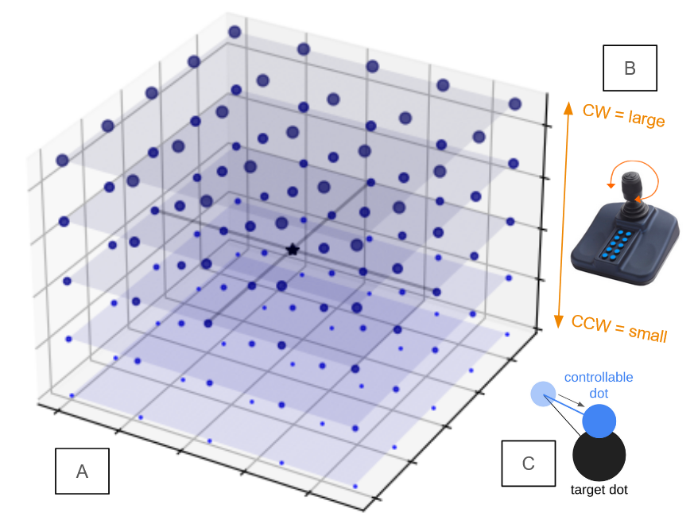
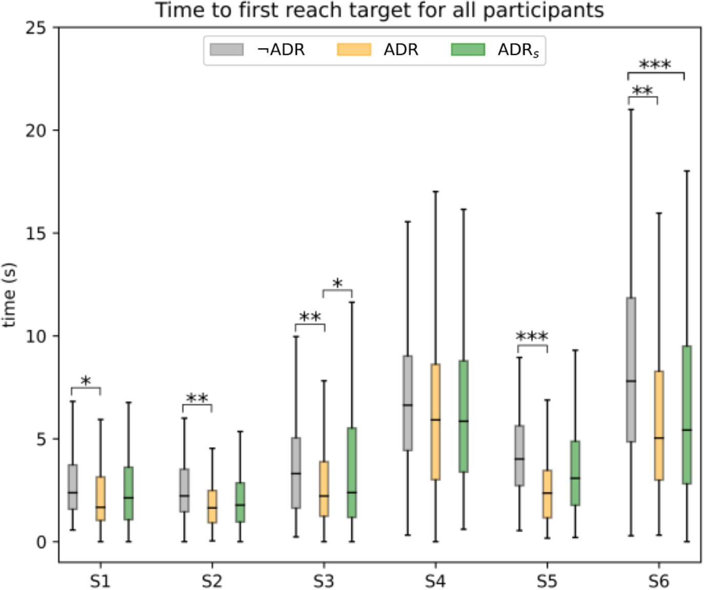
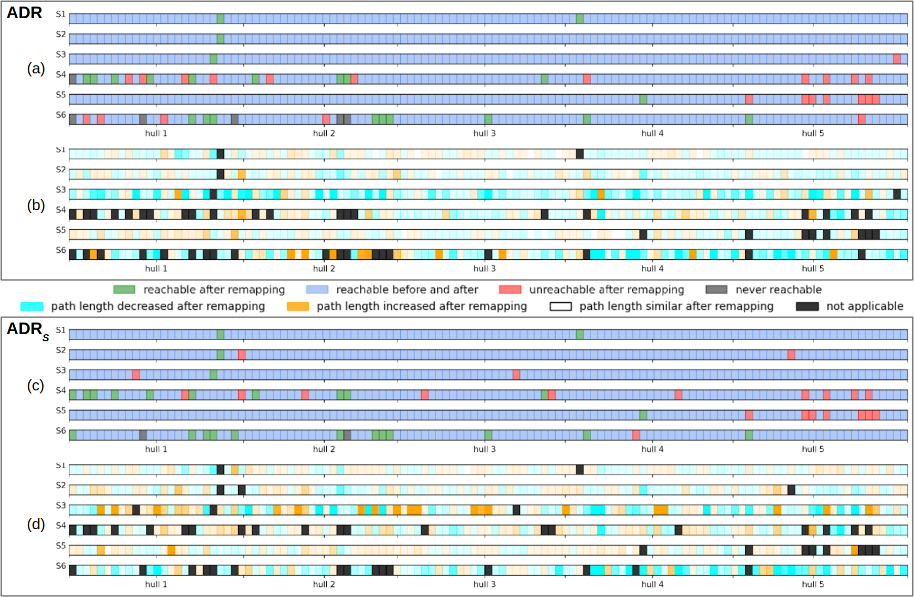

# Bias-Aware Interface Remapping for Assistive Teleoperation

**Expanding access to multi-DOF robotic control by adapting to individual motor constraints**  
*Andrew Thompson, Larisa Loke, Brenna Argall | Northwestern University + Shirley Ryan AbilityLab*

---

## Overview

This project developed and deployed a **bias-aware interface remapping algorithm** for individuals with motor impairments using low-DOF joysticks. The system adaptively reinterprets sparse input patterns to expand access to the full control space of assistive robots—without relying on explicit mode switching.

Unlike fixed axis-aligned control mappings, our method statistically analyzes user-specific input behavior and generates **full-rank mappings** using convex hull expansion and sparse vector decoding. The system was tested in an IRB-approved study involving participants with SCI and stroke.

---

## Motivation

- Many users operate assistive joysticks in **strongly biased patterns** (e.g., circular motion or single-axis preference).
- These constraints reduce access to the full range of robotic functionality (e.g., 6-DOF control).
- Existing solutions rely on **mode switching**, which adds cognitive burden and impedes fluidity.
- Our system remaps these biased inputs into full-rank command spaces by **learning from natural user behavior**.

---

## System Design

### Input Space Modeling

- Captured joystick trajectories across calibration tasks.
- Computed empirical **convex hull** of user input space.
- Identified **input directions with low variance or dropout**.
- Constructed a mapping matrix to distribute joystick movement over 6-DOF robot control space.

### Mapping Strategy

- Used **sparse basis expansion** to project 2–3 axis joystick data to a higher-rank output vector.
- Added **gain compensation** and thresholding logic to stabilize near-degenerate directions.
- Embedded mapping in real-time teleoperation loop using ROS2.

<!-- > _**📷 This would be a good place to include a block diagram of the remapping pipeline**_ -->

---

## Deployment & Evaluation

- **Study Participants**: N = 8  
  (5 SCI, 3 Stroke)  
- **Hardware**: 3-axis assistive joystick (mounted), Kinova Gen2 robotic arm  
- **Tasks**:  
  - 2D planar reaches  
  - 3D endpoint positioning  
  - Orientation alignment tasks

### Metrics Collected

- Task completion time  
- Path smoothness  
- Input command entropy  
- Control subspace utilization  
- GUI logs and qualitative feedback

<!-- > _**📷 This would be a good place to show GUI overlay of input traces or task progress**_ -->

---

## Key Contributions

- Developed a **real-time remapping algorithm** that dynamically adapts to user-specific bias patterns.
- Enabled full 6-DOF control from a low-DOF joystick with **no mode switching**.
- Designed a **custom OpenGL-based GUI** to collect detailed usage metrics and visualize interface behavior.
- Demonstrated **measurable performance improvement** and increased expressiveness over baseline mappings.

<!-- 

<video class="center" src="{{site.baseurl}}/videos/Idealab_bias_2022_2x_speed.mp4" data-canonical-src="{{site.baseurl}}/videos/Idealab_bias_2022_2x_speed.mp4" controls="controls" style="max-height:640px;">

</video>

 -->

---

## Design Tradeoffs

| Challenge | Approach |
|----------|----------|
| Near-singular input patterns | Used convex hull regularization + sparse decoding |
| Real-time stability | Applied smoothing and bounded velocity control |
| Adaptability vs. user learning | Fixed mapping per session to allow learning, but tunable between sessions |
| Interface generality | Mapping tailored per user but used shared core logic |

---

## Citation

> ICORR 2022:  
> **Control Interface Remapping for Bias-Aware Assistive Teleoperation**  
> *Andrew Thompson, Larisa Loke, Brenna Argall*

---

## Access

The interface mapping logic and experimental task GUI are implemented in a private ROS + OpenGL research repository.  
- Summary PDF, logs, and sanitized code excerpts available upon request.  
- Core algorithm written in Python; live integration with Kinova control via ROS2 services.

---
