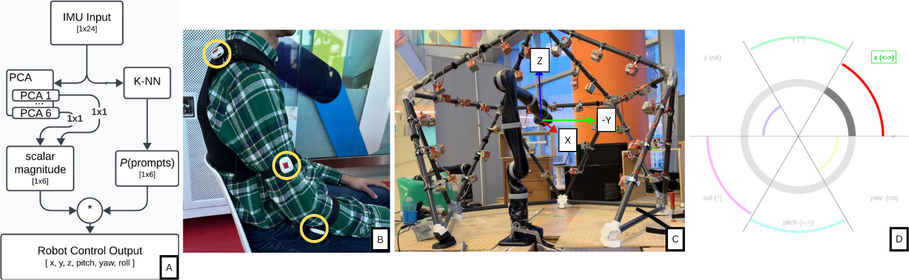
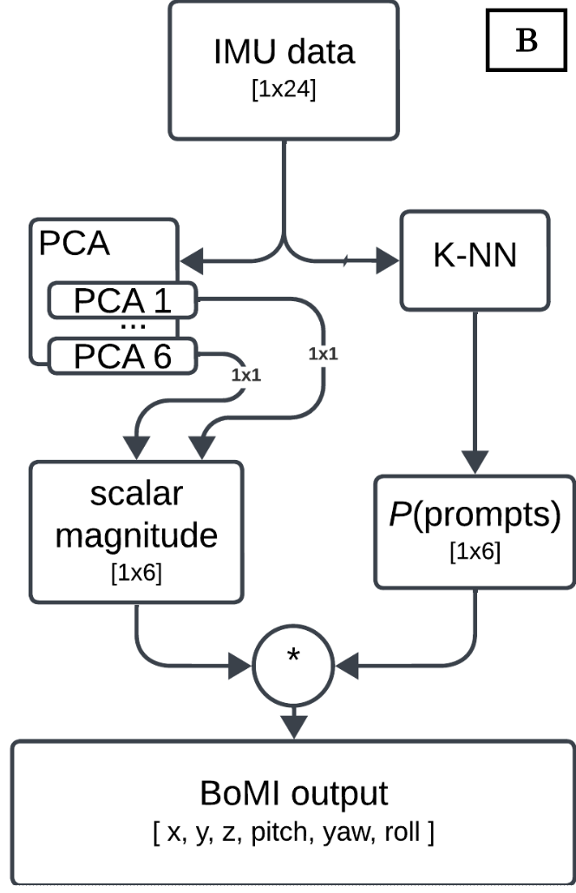

<!-- 
To force 2 columns and center featured images on project tiles, you likely need to adjust your portfolio page's CSS or grid layout, not just the markdown. 
However, for markdown, ensure the featured_image is set as above. 
If your site uses a grid system (e.g., CSS Flexbox or Grid), check for a property like `grid-template-columns: repeat(2, 1fr);` or similar in your stylesheet.
To center images in markdown, you can use:

<div align="center">
      
</div>

But actual column layout is controlled by your site's HTML/CSS, not markdown alone.
-->


**Real-time human-in-the-loop control using wearable IMUs and low-dimensional motion mappings**  
*Andrew Thompson, Fabio Rizzoglio, Fiona Neylon, Demiana Barsoum, Max McCune, Lucy Ammon, Brenna Argall, Lee Miller | Northwestern University + Shirley Ryan AbilityLab*

---

## Overview

This system enables individuals with cervical-level spinal cord injuries (SCI) to teleoperate a 6-DOF robotic arm in real time using residual body motions. It uses wearable IMUs and a participant-specific PCA-based control mapping to transform high-dimensional motion data into robot control commands without requiring mode switching. The system was deployed in a longitudinal, IRB-approved human-subject study and served as the basis for ongoing research into generative alternatives.



---

## System Architecture

<!-- ```text
[IMUs (x-IMU3)] 
      ↓
[ROS2 Sensor Wrapper (C++)]
      ↓
[Signal Processing Pipeline (Python)]
      ↓
[PCA Projection (per user)]
      ↓
[ROS2 Teleop Node] → [Robotic Arm (Kinova Gen2)]
      ↓
[OpenGL Feedback GUI]
      ↓
[Data Logging (.csv + .bag)]
``` -->




---

## Key System Components

### PCA-Based Mapping
- Calibrated for each participant using motion demonstration trials.
- PCA projection used to reduce dimensionality and map to 6-DOF Cartesian velocity (Twist) control.
- Allowed full-rank continuous control without the need for explicit mode switching.

### ROS2 Integration
- Custom C++ ROS2 driver for x-IMU3 sensors.
- Handles real-time quaternion streaming, timestamp synchronization, and message publishing.
- ROS2 nodes handle teleop, filtering, GUI feedback, and system-level coordination.

### Feedback and User Interface
- OpenGL-based GUI for target tasks and visual performance feedback.
- Displays real-time cursor, active target regions, and system state indicators.
- Designed for cognitive load minimization and accessibility.

### Study Deployment
- Deployed with 10 participants with SCI in 190+ sessions.
- Participants performed planar reach, 3D manipulation, and alignment tasks.
- No mode switching required during control tasks.

<!-- <div>
<video class="center" src="{{site.baseurl}}/videos/hri_lbr_5.mp4" data-canonical-src="{{site.baseurl}}/videos/hri_lbr_5.mp4" controls="controls" style="max-height:640px;">

</video>
</div> -->

---

## Design Considerations & Tradeoffs

| Design Challenge               | Strategy / Solution                                           |
|-------------------------------|----------------------------------------------------------------|
| Remove need for mode switching| Full-rank PCA-based projection per user                        |
| Smooth control vs. responsiveness | 2nd order Butterworth filter, tunable cutoff            |
| Robustness across ability levels | Per-user calibration with fallback for 3–DoF cases       |
| Safety-critical use case      | Hold-to-enable switch, velocity bounding, kill switch         |

<!-- > _**📷 Optional: include a diagram showing PCA axis mapping or user-specific motion vectors**_ -->

---

## Results

- Users achieved stable, full 6-DOF control using individualized motion spaces.
- Across-session improvements in performance and confidence were observed.
- The system maintained real-time performance across a range of motor profiles.
- Dataset from study now forms the basis for post hoc modeling and evaluation.


---

## Subsection: VAE-Based Mapping (Ongoing Generative Work)

As a follow-up to the PCA-based deployment, we trained VAE-based generative latent models on participant data. These models aim to support:

- Robust few-shot control embeddings  
- Intent disambiguation via latent uncertainty  
- Smooth interpolation across motion samples

The VAE-based system is currently undergoing evaluation for generalization, stability, and interpretability. It has **not been deployed in the study**.

---

## Repository & Access

This system is implemented across internal private repositories maintained by our lab.  
- ROS2 IMU wrapper (x-IMU3) → release pending  
- Unity–ROS2 TCP back-end → under internal documentation review  
- Example CSV logs and controller configs available upon request

---
