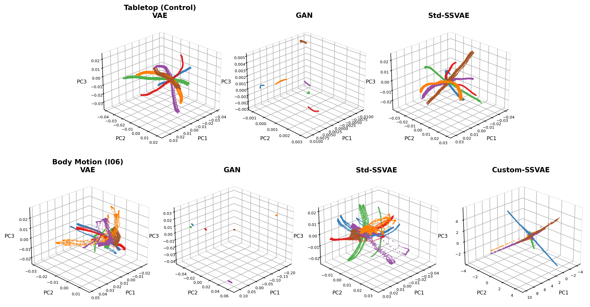
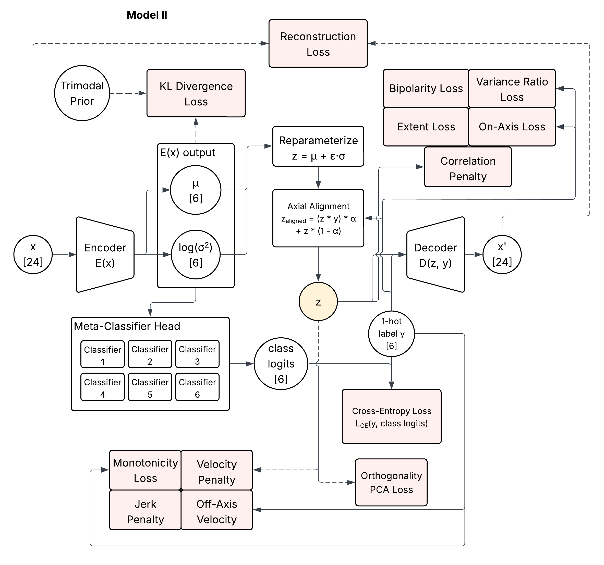
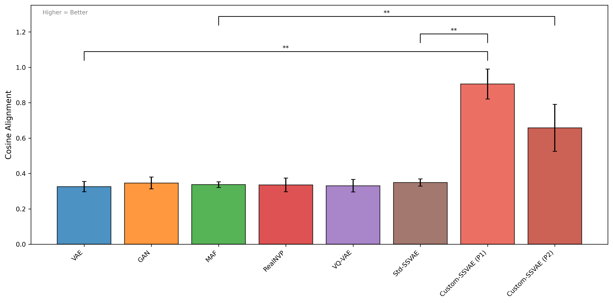
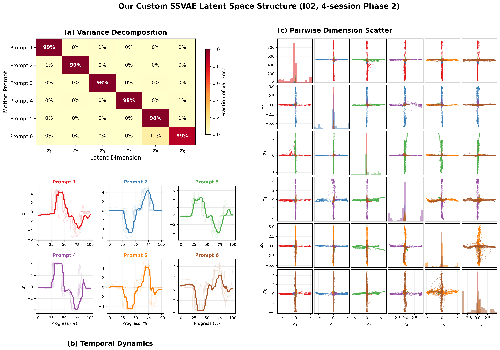
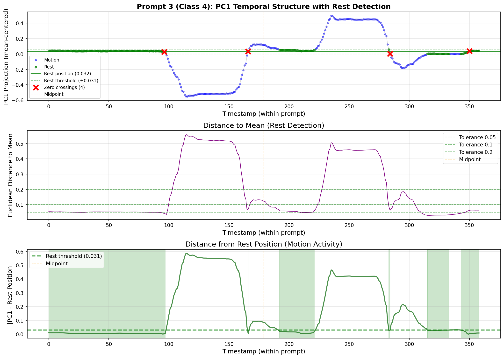

**A custom semi-supervised VAE that turns residual body motion in high-level spinal cord injury into direct, proportional 6-DoF control of a robotic arm.**  
*Andrew Thompson, Fiona Neylon, Brenna Argall | Northwestern University + Shirley Ryan AbilityLab*

*Body-machine interfaces · Representation learning · Generative models · Applied statistics*

---

*3D latent-space comparison: the custom SSVAE (right column) is the only model that produces a clean, axis-aligned, bipolar structure on real body-motion data (bottom row). That property is what lets the latent space double as a controller.*

## The problem

People with high-level cervical spinal cord injuries retain only residual motion — a head tilt, a small wrist twitch — but existing assistive interfaces for controlling a robotic arm are largely **mode-switching** (operate one degree of freedom at a time) or **discrete** (sip-and-puff), which is slow and cognitively demanding for continuous 6-DoF tasks like reaching or manipulating objects.

My goal was a mapping from raw, high-dimensional IMU sensor data directly to a 6-D control signal: proportional, simultaneous across all axes, and usable without bolting on an extra hand-engineered transformation after the fact.

That last part is what turns this into a representation-learning problem rather than a plain classification one. A generic VAE or semi-supervised VAE will readily learn a latent space that separates six motion classes, but nothing forces those classes to line up with the coordinate axes of the space. If class "wrist twist right" is separable yet sits at some arbitrary angle instead of along axis 3, mapping axis 3 to robot joint 3 means learning another transformation on top of the model, with no guarantee that transformation is stable, or even learnable.

## The approach

I designed a set of custom geometric and temporal loss terms that force the latent space itself to become a usable controller, layered on top of a semi-supervised VAE trained in two phases:

*Full training architecture. Reconstruction and KL-divergence losses are standard VAE machinery; the geometric regularizers (orthogonality, bipolarity, extent, variance ratio, correlation penalty) and temporal regularizers (monotonicity, velocity, jerk) are the custom contribution.*

- **Phase 1 — geometric structure.** A trimodal KL-divergence prior directly encodes the known rest → positive-extent / rest → negative-extent structure of each motion prompt into the latent prior itself, rather than assuming a single Gaussian mode per class. Additional terms enforce orthogonality between class directions, bipolarity (symmetric positive/negative spread about the origin), and variance concentrated on the correct axis rather than leaking into others.
- **Phase 2 — temporal refinement.** After Phase 1 pretraining, monotonicity, velocity-smoothness, and jerk penalties are added, computed on temporally-ordered (not shuffled) sequences, to shape smooth, reversal-free trajectories through the latent space during a calibration motion.
- **A stateless, feedforward encoder** by design. The model never uses temporal context at inference time, only during training: the latent space functions like a physical joystick, where the same input always maps to the same output, with zero control-loop latency and no dependence on history.

Every term in the final loss design earned its place through a controlled ablation study on an earlier iteration of the model, not a first guess that happened to work. Individually and in combination, across 10 participants and 3 random seeds, one regularizer turned out to be doing almost all of the work (+124% improvement, Cohen's *d* = -5.63), while others were inconsistent or actively harmful in combination together. That result drove the final term selection: drop what wasn't earning its cost, and split the one term that mattered into several more targeted ones.

## Results

Evaluated against 6 baseline generative model families (VAE, GAN, VQ-VAE, RealNVP, MAF, standard SSVAE) across 8 participants with cervical spinal cord injury, using paired nonparametric statistics (Wilcoxon signed-rank, Bonferroni-corrected across the primary metric family, effect sizes reported):

| Metric | Baselines | Custom SSVAE | Change | Significance |
|---|---|---|---|---|
| Cosine Alignment | 0.32 | 0.78 | +145% | *p* < 0.001, *d* > 2.5 |
| On-Axis Fraction | 0.17 | 0.84 | +382% | *p* < 0.001, *d* > 2.5 |
| Orthogonality | 0.02 | 0.59 | +2684% | *p* < 0.001, *d* > 2.5 |
| Off-Axis Contamination | 0.83 | 0.16 | −81% | *p* < 0.001, *d* > 2.5 |
| Bipolarity (absolute) | 0.036 | 0.576 | +1500% | descriptive only — n.s. after correction |

*Cosine alignment across all compared architectures. The custom SSVAE is the only model family that reliably aligns class directions with the latent space's coordinate axes.*

Standard generative-model metrics like FID, ELBO, or reconstruction error don't answer the question that actually matters for a controller: whether the latent axes correspond to control channels a person can operate independently. So this project's evaluation uses a purpose-built metric suite instead: cosine alignment, on-axis fraction, orthogonality score, bipolarity, and predictive VAF, each chosen because standard generative-model evaluation doesn't measure it.

*(a) Each motion prompt concentrates its variance almost entirely in a single designated latent dimension (near-diagonal heatmap). (b) Latent trajectories follow smooth, symmetric rest → peak → rest paths. (c) Cross-shaped scatter patterns confirm mutually orthogonal class directions — all consistent with a latent space that behaves like a well-calibrated joystick.*

The model also generalizes across a longitudinal study (multi-session training spanning a ~2.5-month calibration period) and reduces inter-participant variability relative to baselines, despite substantial heterogeneity in injury level and residual motor ability across the cohort.

### Generalization across users

Earlier exploratory work on this project (before the geometric/temporal loss design above was finalized) looked specifically at whether the learned structure transfers between people, rather than just across sessions for the same person. Two results from that phase carried forward into the final system:

- **Cross-user generalization** — training the encoder on one participant and evaluating on another showed that the latent axes retain their structure, though the decoder still needed fine-tuning to turn that structure into accurate control output for the new user. In other words, the geometry transfers more readily than the exact control mapping does.
- **Few-shot retraining** — fine-tuning on a small new-user calibration set (20-50 examples) converged rapidly, which is the practical version of that same finding: a new user doesn't need a full session's worth of data before the system becomes usable.

## From sensor to controller

*Every calibration motion follows a fixed rest → positive-extent → rest → negative-extent → rest structure — the physical basis for the trimodal prior used in the loss design above.*

The input is 24-dimensional: six body-worn IMUs, each producing a quaternion, individually placed per participant based on their specific residual motor ability (a wrist twitch for one participant, a head tilt for another). The trained encoder runs as the perception front-end of a real-time ROS 2 control node at 100 Hz, replacing an earlier KNN + per-class-PCA pipeline (retained as an automatic fallback). Per-DOF control gains are derived directly from each latent axis's learned extent, and inference reads out the encoder's deterministic output rather than a stochastic sample, since the control mapping needs to be exactly reproducible on every tick.

## What I'd highlight in a technical conversation

Every regularizer in the loss term set earned its place through measurement, not intuition — that's probably the single thing I'd lead with. Close behind it: the metric suite is its own piece of the work. Standard generative-model metrics don't capture what a control application needs, so defining and validating ones that do took real effort, not an afterthought bolted onto the results section.

I also tried to hold a high bar statistically at a small sample size — n = 8, a heterogeneous population, nonparametric paired tests, and transparent reporting of what did and didn't clear a corrected significance threshold, including a negative result I was glad to report plainly (monotonicity was already present in every baseline, so it wasn't something this method needed to improve). And the "stateless controller" principle that shaped the architecture isn't only a paper claim: it's the same reasoning behind reading out the deterministic latent mean, not a sampled draw, in the real-time inference code that actually runs the robot.

## Stack

PyTorch · Optuna (TPE + Hyperband pruning) for hyperparameter search · Weights & Biases for experiment tracking · scipy/statsmodels for statistical testing · ROS 2 for real-time deployment.

---

*Manuscript in preparation for IEEE Transactions on Neural Systems and Rehabilitation Engineering (TNSRE); a fuller treatment appears in my PhD dissertation. Figures above are drawn directly from that work.*
