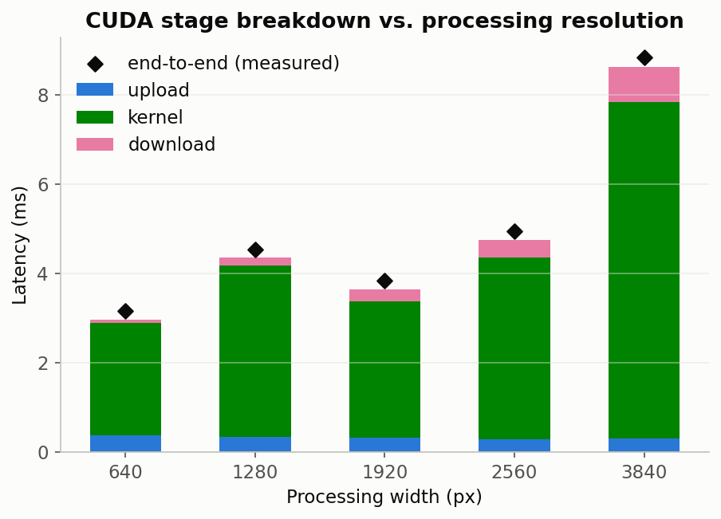
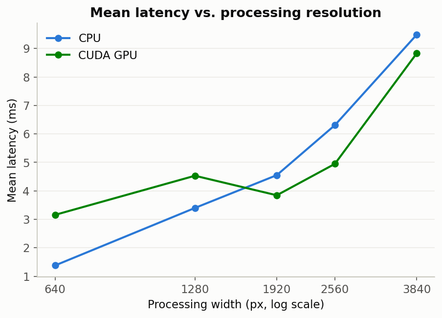
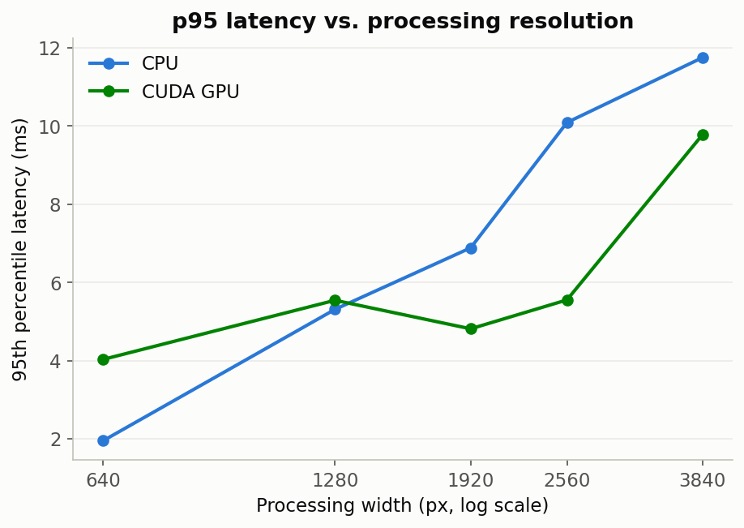
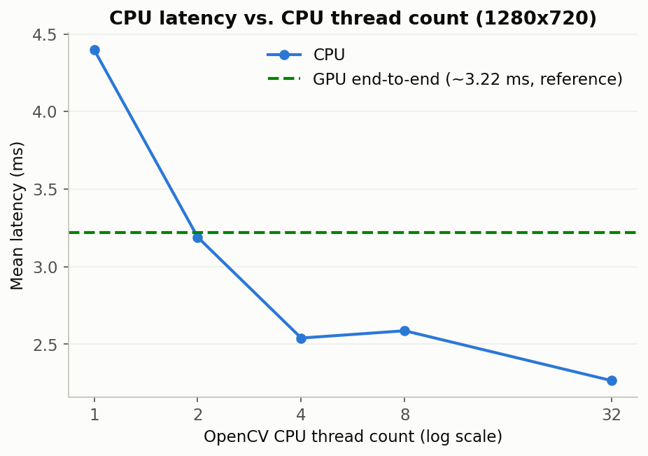
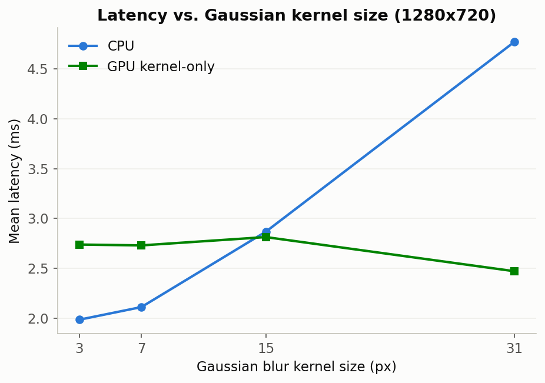
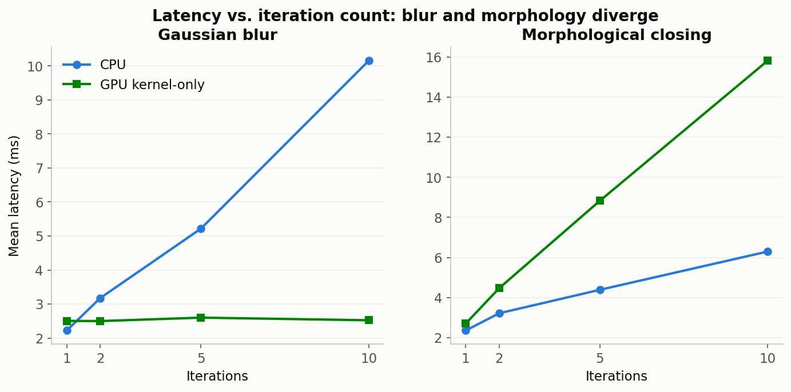
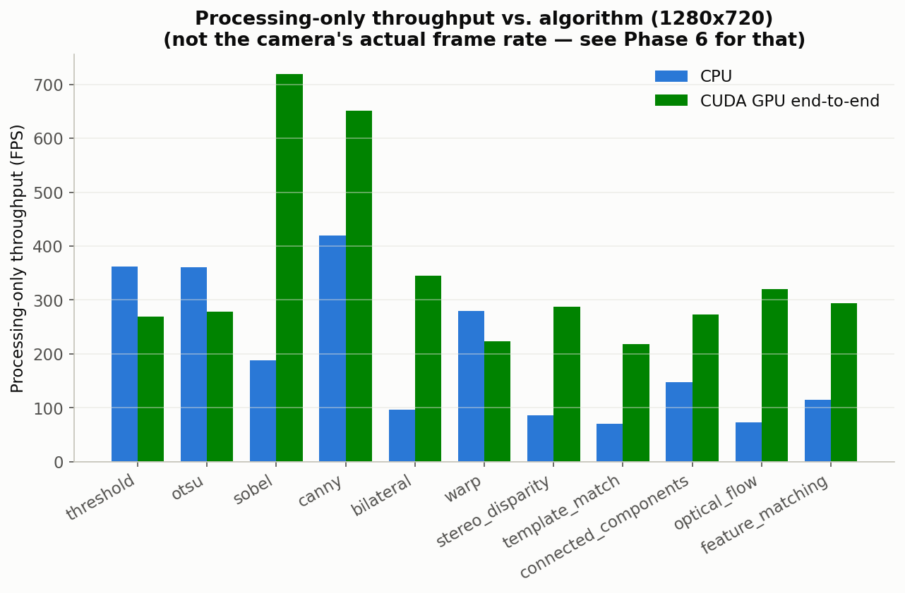
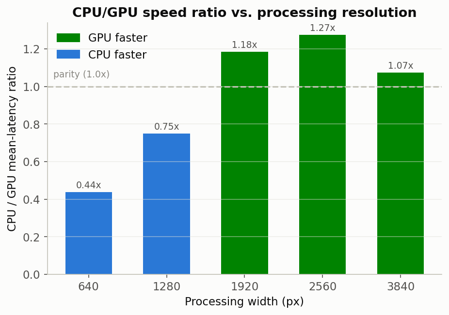
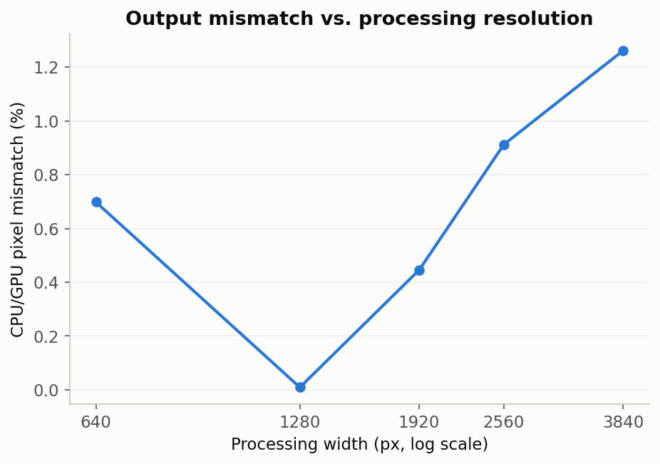

**Benchmarking a classical OpenCV pipeline on CPU vs. CUDA on real laptop hardware to find out when GPU acceleration actually pays off**  
*Andrew Thompson*

---

This is the classical computer-vision half of a two-part project; the companion piece is [Plant Species & Disease Classification]({{site.baseurl}}/project/0018-plant-classifier), which trains models on GPU instead of running fixed algorithms on one.

I wanted to know, concretely and on my own hardware, when moving a
classical computer vision pipeline onto a GPU is worth it. Not a synthetic
benchmark on server-class hardware, but a real webcam, a laptop GPU, and a
pipeline shape that looks like something you'd actually run on a robot.

**System:** Ubuntu 24.04, NVIDIA GeForce RTX 4050 Laptop GPU (driver
580.95.05), CUDA 12.9, OpenCV 4.13.0 built with CUDA support, a 1280x720 USB
webcam over V4L2. Laptop-class GPU, not a data-center card, closer to what
you'd find bolted onto a robot than to what most published benchmarks use.

## The starting observation

I benchmarked a naive 5-stage pipeline end to end on both backends: resize,
Gaussian blur, grayscale, threshold, morphological close, roughly what a
blob-detection perception node might run. The result surprised me. The CPU
pipeline beat the naive CUDA pipeline at every resolution I tested. GPU
upload/download and kernel-launch overhead was outweighing whatever compute
savings the GPU offered on a pipeline this light.

That result is the reason the rest of this project exists. Instead of
accepting "CPU wins" and moving on, I wanted to know why, and where the
GPU's advantage shows up if it shows up anywhere at all.

---

## Decomposing GPU time: transfer overhead isn't the whole story

First step was instrumenting the CUDA path with per-stage timing: upload,
kernel execution via CUDA events rather than wall-clock, and download,
instead of one lumped "GPU" number.



Kernel-only GPU time can exceed CPU time even at low resolution, so this
isn't purely a transfer-overhead story. At 640x480, kernel time alone
(2.66 ms) already exceeded total CPU time (1.42 ms), before any
upload/download cost got added:

| Resolution | CPU mean | GPU kernel mean | GPU end-to-end |
|---|---:|---:|---:|
| 640x480 | 1.42 ms | 2.66 ms | 3.26-3.34 ms |
| 1280x720 | 2.16-2.20 ms | 2.66-3.44 ms | 3.35-4.15 ms |
| 1920x1080 | 4.65-5.03 ms | 3.01-4.05 ms | 3.79-4.85 ms |

The shape here is the whole story in miniature. GPU kernel time stays
nearly flat as resolution grows, while CPU time scales up almost linearly.
The GPU isn't winning by being fast. It's winning by not getting slower.

### Preallocating GPU buffers recovers real time

Some of what looked like "kernel time" above was GPU memory allocation, not
compute. Swapping implicit per-call `GpuMat` allocation for reusable
ping-pong buffer pairs cut end-to-end GPU latency by:

| Resolution | Reduction |
|---|---:|
| 640x480 | 3.6% |
| 1280x720 | 17.0% |
| 1920x1080 | 19.1% |

Savings scale with resolution because allocation cost scales with buffer
size, which is invisible until you split "kernel" into "allocate" and
"compute" and look at them separately.

---

## When does the GPU actually win?

Four things turned out to control whether the GPU pulls ahead: how many CPU
cores are free, how expensive the operation is, how many times it repeats,
and which algorithm it is.

### 1. CPU thread contention



Sweeping `--cpu-threads` at 1280x720, the GPU only beats the CPU pipeline
at 1 thread: 4.415 ms CPU vs. 3.599 ms GPU, a 1.23x edge. That's the one
setup that resembles a robot with a single core free for this task. CPU
performance improves sharply from 1 to 4 threads (4.415 to 2.284 ms), then
plateaus and regresses slightly at 8 threads (2.981 ms), likely thread-pool
oversubscription on a workload this small.



Tail latency tells a sharper version of the same story: the p95 gap between
backends is wider than the mean-latency gap at every resolution tested,
which matters more than the mean does for anything with a real-time
deadline, like a control loop that can tolerate a slow average far more
easily than an occasional slow frame.



There was a smaller finding here I didn't expect: GPU kernel time itself
crept up slightly as `--cpu-threads` increased, 2.93 to 3.40 ms, plausibly
scheduling contention between OpenCV's CPU thread pool and the host thread
driving CUDA dispatch. The two backends aren't as independent as "just pick
one" framing suggests.

### 2. Per-operation cost and kernel size



Across a 3x3 to 31x31 Gaussian kernel sweep (CUDA's separable filter caps
at 32; 51x51 isn't reachable via `cv2.cuda.createGaussianFilter` at all),
GPU kernel time stayed essentially flat, around 2.6-2.7 ms, while CPU time
nearly tripled, 1.91 to 4.86 ms, crossing over at 31x31 where the GPU
pulled 46% ahead end-to-end. Heavier per-pixel work is exactly what
parallel hardware is for, and the crossover point is a direct measurement
of how much work justifies the fixed overhead.

### 3. Iteration count



I expected repeating an operation to favor whichever backend was faster
per-call, and that held for blur. Repeats are nearly free on the GPU (flat
2.6-2.8 ms for 1 to 10 iterations) while CPU scales about 1 ms/iteration,
so by 10 iterations the GPU is 3.1x faster.

Morphological closing did the opposite. GPU scales worse per iteration than
CPU here, about 1.5 ms/iteration on the GPU against 0.44 ms/iteration on
the CPU, so by 10 iterations CPU comes out about 2.7x faster. Not every
operation benefits equally from GPU parallelism. On this OpenCV/CUDA build,
morphological closing carries a much higher per-call cost than Gaussian
blur does, which is probably the single most useful thing I found here for
avoiding a bad default assumption: "GPU-accelerated" is a property of the
operation, not of the pipeline as a whole.

### 4. Image size: a peak, not a plateau

Sweeping 640x480 through 3840x2160, the crossover sits between 1280x720 and
1920x1080. The GPU's advantage peaks around 2560x1440 (1.275x) and then
narrows again at 4K (1.074x), because download time grows with output size
and eats into the growing kernel-time advantage. "Bigger images always
favor the GPU more" isn't quite true. There's a sweet spot.

### 5. Algorithm choice



I extended the pipeline to eleven algorithms plus Otsu thresholding at
1280x720, and the effect turned out to be highly algorithm-dependent:

| Algorithm | Speed ratio (CPU/GPU end-to-end) | Mask IoU | Note |
|---|---:|---:|---|
| sobel | 1.7-3.8x GPU | 0.987 | |
| canny | 1.55x GPU | 0.931 | hysteresis edge-linking is discrete/order-sensitive |
| bilateral | 3.6x GPU | 0.999999768 | downstream threshold erases filter-level noise |
| otsu | 0.77x CPU | 0.9998 | behaves like a slightly heavier fixed-threshold variant |
| optical_flow (sparse LK) | 4.4x GPU | 0.16 synthetic / 0.95 real camera | synthetic source misleads correctness eval, see below |
| warp | 0.80x CPU | 0.999 | only new algorithm still CPU-favored; too cheap to cross over |
| stereo_disparity | 3.4x GPU | 0.51 | real, verified divergence, see below |
| template_match | 3.1x GPU | 0.9999 | fixed template cached from first frame |
| connected_components | 1.85x GPU | 0.9999 | GPU primitive has no per-blob stats, so no area filtering applied |
| feature_matching (ORB+BFMatcher) | 2.3x GPU | 0.65-0.70 | same discrete-decision sensitivity as canny |

One methodology lesson came out of this that's worth carrying forward. The
synthetic frame source I was using, 12 frames on a loop, was fine for
timing every algorithm but actively misleading for correctness evaluation
of anything depending on real frame-to-frame continuity (optical flow) or
real texture (stereo block matching). A cycled synthetic loop has no real
motion or parallax for those algorithms to track, so I had to re-verify
correctness for that class of algorithm against real camera footage
instead.

### Speed ratio, all resolutions at a glance



---

## Does throughput even matter with a real camera in the loop?

Everything above measures processing time, but a real pipeline is also
gated by capture time. I added a `--live` mode: single backend per run,
camera capture time folded into every measurement, dropped-frame counting,
and CPU/GPU utilization sampled on a background thread (`psutil` and
`nvidia-smi`, polled every 250 ms, kept outside the timed loop).

This confirmed my original hunch almost exactly. Camera capture, about
25-30 ms since the webcam caps out near 30 FPS, completely dominates over
processing (3-8 ms) on either backend. Loop throughput landed at
30.08-30.09 FPS regardless of which backend was doing the processing. The
camera is the bottleneck here, not the pipeline, at least at this
resolution and on this hardware.

One thing I didn't expect going in: at identical throughput, the CPU
backend consistently used roughly 9-10x more host CPU than the CUDA
backend (486% vs. 50% process CPU in the full run, 157% vs. 35% in an
earlier smoke test, the ratio held across both). Raw speed is a wash here,
but CPU budget is not. On a robot where other nodes are competing for CPU
cycles, that's the number that matters, even when wall-clock throughput
looks identical between the two.

---

## Is the GPU output even the same as the CPU output?

Every ratio above means nothing if the two backends silently disagree about
the answer. I built a separate diagnostics script, deliberately kept out of
the performance-timing path so the extra instrumentation never touches the
timing numbers above, that saves per sampled frame: the original image,
the CPU mask, the GPU mask, an absolute-difference mask, a red-highlighted
overlay, plus connected-disagreement-region, border-proximity, and
threshold-proximity stats.


*Left: a sampled input frame. Right: pixels where the CPU and GPU
thresholding pipelines disagree, highlighted in red. It's a small fraction
of a percent, and concentrated at object boundaries rather than scattered
noise.*

To find out where disagreement originates rather than just how much exists,
I fed each pipeline stage (resize, blur, grayscale, threshold) identical
input on both backends and diffed them independently, isolating each
stage's own numerical drift from whatever the previous stage already
contributed:


*The Gaussian blur stage in isolation: CPU output, GPU output, and their
absolute difference, contrast-stretched for visibility. This is where most
of the measurable numerical drift in the whole pipeline originates.*

A few specific questions I wanted this diagnostic to answer, and what it
found:

Resize interpolation contributes essentially zero difference when input and
output resolution match, but a real 2.833 mean-diff shows up when
downscaling 1920x1080 to 1280x720 for real. So resize interpolation is a
genuine drift source, precisely when it's doing actual work.

Gaussian-filter rounding is tiny: mean diff 0.006-0.008, only 1.6-2.3% of
pixels affected at all, consistent with sub-1-unit precision noise rather
than a structural bug.

Border modes look consistent between backends. Border-to-interior diff
ratios sat near 1.0x across every stage, with no evidence CPU and GPU use
meaningfully different border-extrapolation modes at the kernel sizes I
tested.

Edge-of-frame artifacts aren't the story either. Only about 0.6-1.1% of
disagreement falls within 5px of the image edge, so the disagreement is
about object and blob edges, not frame edges.

Whether any of this matters for the task is the question I cared about
most. Mean disagreement was 0.003-0.3% of pixels, and 98-100% of all
differing pixels had a grayscale value within 10 levels of the threshold.
Nearly all the observed disagreement is explained by borderline pixels
sitting right on the threshold's decision boundary, where tiny upstream
numerical drift is enough to flip the outcome. Unlikely to matter for a
typical blob-detection perception task.



---

## Methodology notes worth carrying into the next project

IoU and mismatch-percent here are backend-consistency metrics, not accuracy
metrics. I'm comparing CPU output against GPU output of the same
deterministic algorithm; neither one is ground truth. A low IoU, like
stereo disparity's 0.51, means these two implementations disagree, not
that the algorithm itself is wrong.

"Kernel time" isn't pure compute for every algorithm. GPU memory
allocation, and for a few algorithms whose OpenCV bindings lack a `stream`
parameter (`connectedComponents`, `DescriptorMatcher.match`), a forced
synchronization point, both get folded into the measured kernel window.

Synthetic benchmark sources are fine for timing and risky for correctness.
This one specifically bit the optical-flow and stereo-disparity
evaluations, because those algorithms depend on real temporal or textural
structure that a small cycled frame set just doesn't have.

---

## Reproducing this

```bash
# Full one-factor-at-a-time sweep against a live camera
./run_experiment_matrix.sh

# Regenerate every plot above from the resulting CSVs
python3 plot_results.py

# Visual correctness diagnostics + stage-isolation deep dive
python3 save_diagnostics.py
```

`benchmark_pipeline.py` is the core timing harness: 11 algorithms, both
backends, CUDA-event kernel timing, optional live-camera mode.
`experiment_matrix.csv` and `benchmark_results.csv` hold the raw numbers
behind every table and chart above.

Still open: ROS 2 node integration, to measure this same CPU/GPU tradeoff
inside an actual perception pipeline instead of a standalone benchmark
harness.
