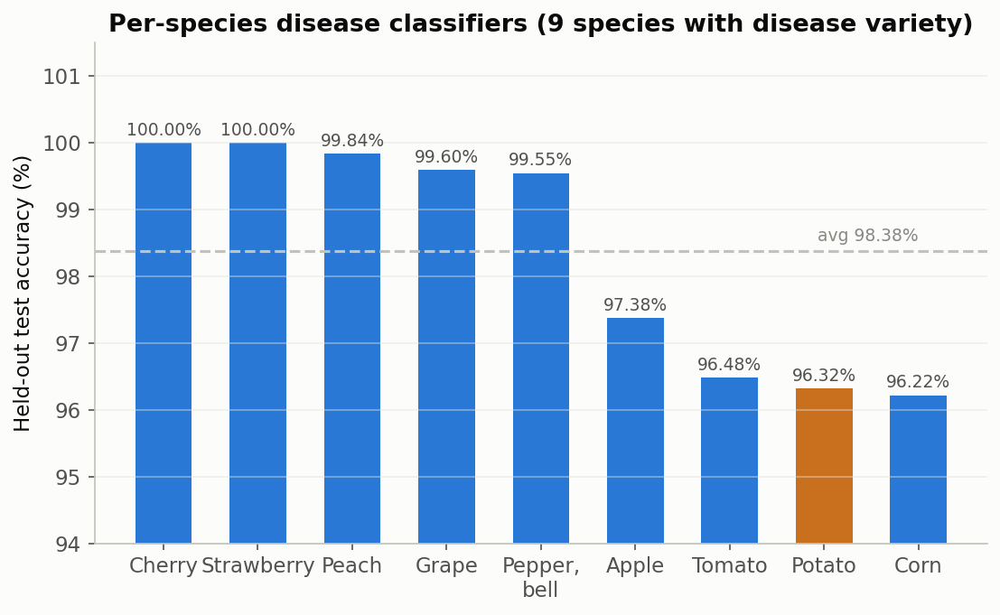
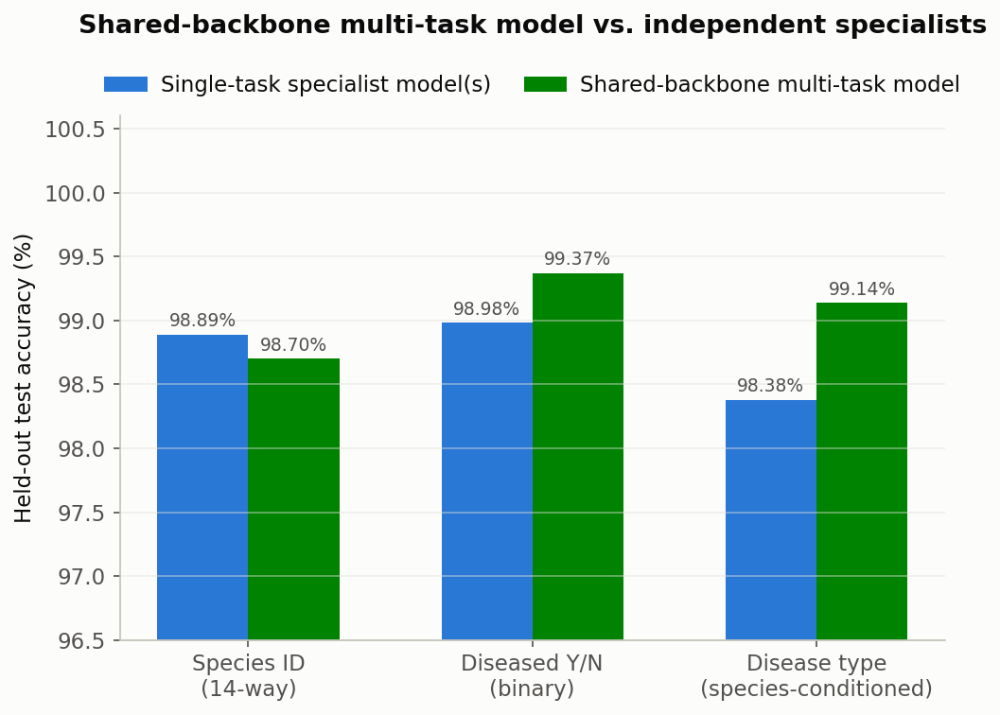
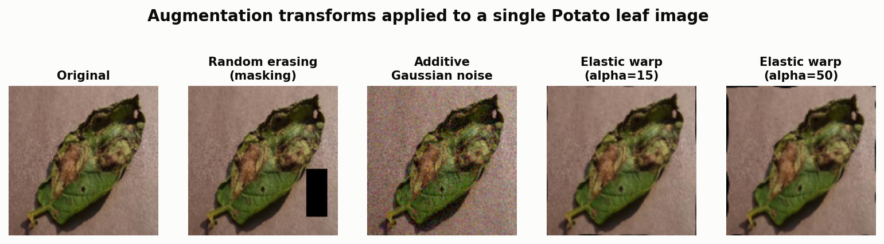
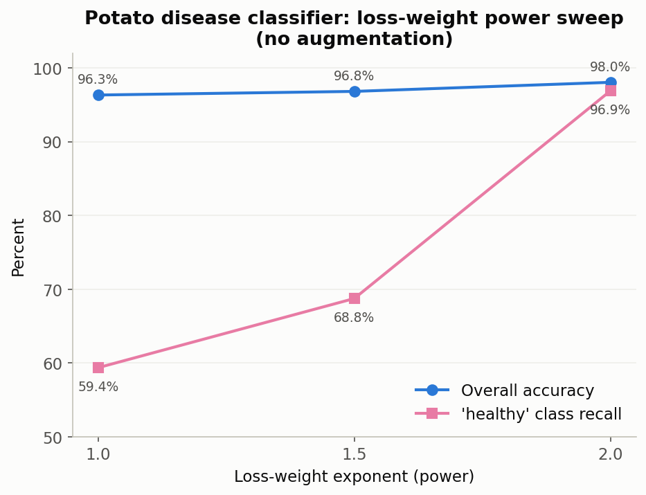
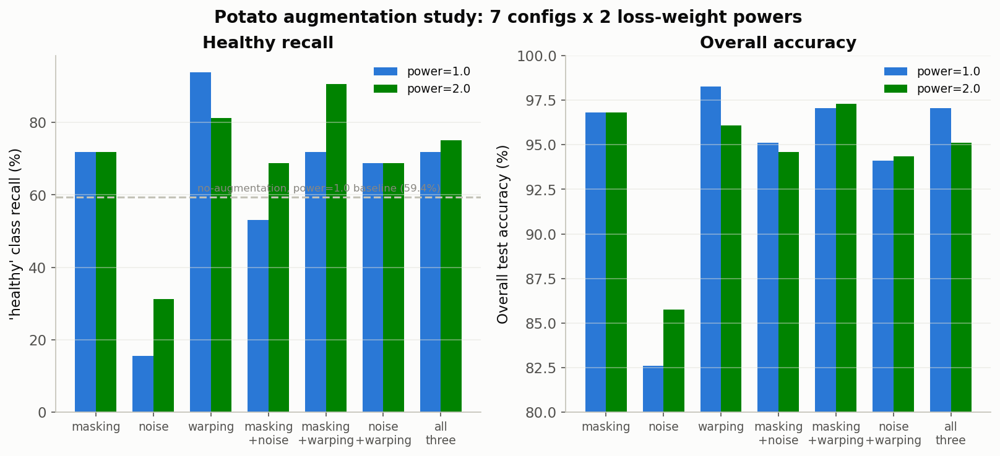
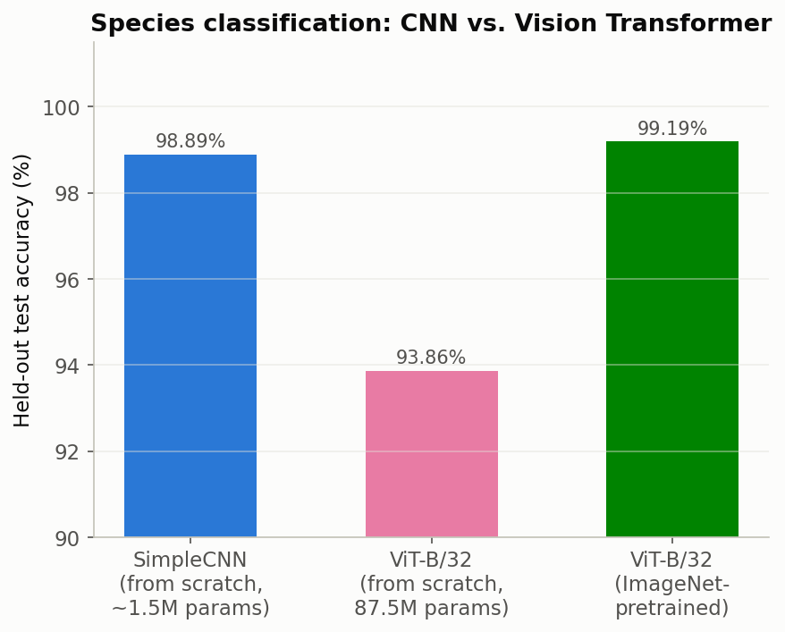

**Deep-learning plant species and disease classification, comparing a small CNN to a Vision Transformer comparison**  
*Andrew Thompson*

---

This is the deep-learning half of a two-part project. The companion piece
is [OpenCV CPU vs. CUDA: Where GPU Acceleration Pays Off]({{site.baseurl}}/project/0017-pipeline-benchmark),
which covers classical image processing on the same machine. Here I wanted
the GPU-acceleration story from the other side: instead of asking whether
CUDA speeds up a fixed algorithm, I'm training the algorithm itself. I used
the [PlantVillage dataset](https://github.com/spMohanty/PlantVillage-Dataset)
[1], 54,306 leaf images across 14 crop species and 38 species/disease
classes, and built up from a single classifier to a shared multi-task model
to a Vision Transformer comparison.

**System:** RTX 4050 Laptop GPU, 6 GB VRAM, PyTorch [2] 2.13.0, torchvision
[3] 0.28.0, CUDA [14] 12.9, Adam [7] as the optimizer everywhere.

---

## Getting the split right before training anything

The first decision mattered more than any model architecture: how to split
train and test without leaking information between them. PlantVillage
contains a lot of near-duplicate photos, the same physical leaf shot from
slightly different angles. A random split will happily put two photos of
the same leaf on both sides of the train/test boundary, which inflates test
accuracy without the model having learned anything that generalizes.

The dataset's maintainers already solved this with official leaf-grouped
splits [1], normally distributed as part of a ~2 GB
[HuggingFace mirror](https://huggingface.co/datasets/mohanty/PlantVillage).
I already had the full image set on disk, so re-downloading 2 GB just to
get the split assignment felt wasteful on a space-constrained machine.
Instead I pulled only the split files themselves (`splits/color_train.txt`
and `color_test.txt`, about 5.2 MB combined) and matched them against the
images I already had. Every model below, from the first species classifier
to the ViT comparison, gets evaluated on that same held-out split, so the
numbers are comparable across the whole project and against PlantVillage's
published baselines.

---

## Three tasks, one dataset

I scoped this in order on purpose: get one task working well before
combining tasks, and get species ID and diseased-status working before the
harder species-conditioned disease-type problem.

### 1. Species identification (14-way)

A small four-block CNN (`SimpleCNN`: conv, batch normalization [6], ReLU,
maxpool, repeated four times, then global average pooling into one linear
head, about 1.5M parameters) trained from scratch for 20 epochs and reached
98.89% held-out test accuracy in around 11 minutes.

### 2. Diseased vs. healthy (binary)

Same architecture, retrained on the binary "is this leaf diseased" question
with class-weighted loss, since the dataset skews toward diseased examples.
It reached 98.98% test accuracy, with 99.29% precision and 99.30% recall on
the diseased class. Recall is the number that matters more here: a missed
diagnosis is worse than a false alarm.

### 3. Per-species disease-type classification

Nine species in the dataset have more than one disease label recorded
(Apple, Cherry, Corn, Grape, Peach, Pepper (bell), Potato, Strawberry,
Tomato); the rest only have a "healthy" tag, so disease-type isn't a
meaningful question for them. I trained a small classifier per species and
averaged 98.38% test accuracy:



Cherry and Strawberry hit a clean 100%. Potato was the outlier at 96.32%,
and accuracy alone hid what was going on underneath: its `healthy` class,
only about 7% of Potato's training examples, had just 59.4% recall. Six out
of every ten genuinely healthy potato leaves were getting flagged as
diseased. That problem got its own dedicated study, which I'll get to
below.

---

## Combining all three into a shared-backbone multi-task model

Once each task worked on its own, the obvious next question was whether one
shared feature extractor could handle all three at once, and whether
sharing features would help or hurt each individual task [12].
`MultiTaskCNN` uses one convolutional backbone with three independent
linear heads: species (14-way), diseased (binary), and full class (38-way
species and disease jointly). The 38-way head does double duty. Mask its
output down to one species' valid classes at inference time and you get
that species' dedicated disease prediction, without needing a separate
variable-sized head per species.



| Task | Single-task specialist(s) | Multi-task (shared backbone) |
|---|---:|---:|
| Species ID (14-way) | 98.89% | 98.70% |
| Diseased Y/N | 98.98% | 99.37% |
| Disease type (species-conditioned) | 98.38% (avg of 9 models) | 99.14% |

The multi-task model gives up 0.19 points on species ID, basically nothing,
and beats the nine independent disease classifiers by 0.76 points on
average using a single shared backbone instead of nine separate ones. That
suggests disease-relevant visual features (lesion texture, discoloration
patterns) transfer usefully across species, even though every species'
disease categories are entirely distinct labels with no overlap.

---

## Fixing Potato's healthy-recall problem

This ended up being the largest single investigation in the project, and
it's also where I made a mistake I'd rather show than quietly edit out.

### The problem

Potato's disease classifier is a 3-class problem (Early_blight,
Late_blight, healthy), and healthy is badly underrepresented in training:
109 of 1,570 images. The baseline model, standard inverse-frequency class
weighting with no augmentation, got 96.32% overall accuracy but only 59.4%
recall on `healthy`, alongside 100% precision. In plain terms: whenever the
model says "healthy" it's right, but it misses most of the actual healthy
cases, defaulting to a disease label whenever it's unsure.

### A false start

My first attempt was `WeightedRandomSampler` oversampling [11] of the
minority class plus heavier augmentation, and at first glance it looked
like a clean win: 98.77% accuracy, healthy recall up to 100% from 94.12%.
It wasn't. Healthy precision had dropped from 100% to 94.12% in that run,
a real tradeoff: more false "healthy" calls on leaves that are genuinely
diseased. Calling the result a clean win would have been wrong, so that
tradeoff is staying in this write-up rather than getting quietly fixed.

Oversampling and heavier augmentation were also stacked together in that
run, which made it hard to isolate which change was responsible for which
effect. So I started over properly: one variable at a time, with the
tradeoffs stated plainly.

### A proper two-factor design

I isolated two independent levers and swept them factorially:

1. **Loss-weight power**: instead of plain inverse-frequency class weights
   [11], an exponent controls how hard the minority class gets up-weighted:
   `weight = (total / (n * count)) ^ power`. Power 1.0 is the baseline,
   equivalent to the original run; higher powers push harder toward the
   rare class.
2. **Data augmentation** [10]: three transforms (random erasing/masking
   [8], additive Gaussian noise, elastic warping [9]), tested individually
   and in every combination:



**Phase A: loss-weight power alone, no augmentation**



| Power | Accuracy | Healthy recall |
|---:|---:|---:|
| 1.0 (baseline) | 96.32% | 59.38% |
| 1.5 | 96.81% | 68.75% |
| 2.0 | 98.04% | 96.88% |

Power 2.0 by itself, no augmentation at all, recovers almost the entire
recall gap. It's the strongest single result in the whole study.

**Phase B: seven augmentation configs, crossed with power 1.0 and 2.0**



| Config | power=1.0 acc / recall | power=2.0 acc / recall |
|---|---:|---:|
| masking only | 96.81% / 71.88% | 96.81% / 71.88% |
| noise only | 82.60% / 15.62% | 85.78% / 31.25% |
| warping only | 98.28% / 93.75% | 96.08% / 81.25% |
| masking + noise | 95.10% / 53.12% | 94.61% / 68.75% |
| masking + warping | 97.06% / 71.88% | 97.30% / 90.62% |
| noise + warping | 94.12% / 68.75% | 94.36% / 68.75% |
| all three | 97.06% / 71.88% | 95.10% / 75.00% |

### What the results show

Noise hurts regardless of loss-weighting. It's the worst standalone config
at both power levels, 15.6% recall at power 1.0, the low point of the
entire study, and it drags down every combination it touches. My guess is
that additive Gaussian noise on a leaf-texture task destroys exactly the
fine-grained texture signal the model relies on.

Warping has real standalone value, but it doesn't play well with
aggressive reweighting. `warping_only` at power 1.0 is the best config in
the whole study (98.28% accuracy, 93.75% recall), but the same
augmentation at power 2.0 is worse (96.08% / 81.25%) than power 2.0 with no
augmentation at all. Warping and a high loss-weight exponent are both, in
their own way, telling the model to try harder on the minority class, and
stacking them over-corrects. It's the same double-regularization pattern
that explains, in hindsight, why the original oversampling run cost
precision.

Masking is mild and mostly power-independent: 71.88% recall at both power
1.0 and power 2.0, an exact tie I'd chalk up to coincidence rather than a
real effect without more runs to confirm it. It's a gentle augmentation
that doesn't move the needle much either way.

Combinations inherit their worst component. Every combination that
includes noise underperforms the equivalent noise-free config; there's no
case where adding noise to an already-good combination helps it.

### Two configs worth defending

There's no single winner here. Two configurations are each reasonable,
depending on what you're optimizing for:

- **Power 2.0, no augmentation**: strongest recall (96.88%) and the
  simplest intervention, one lever, nothing else changed. Pick this if
  missing a healthy leaf is the failure mode you care about most.
- **Power 1.0 with warping only**: best overall accuracy (98.28%) and a
  milder change from the untouched baseline recipe, no loss-function
  tuning involved. Pick this if you want the smallest change that still
  fixes the problem.

Both beat the 59.4% baseline recall by a wide margin, and neither needs the
oversampling approach that kicked off this whole investigation.

---

## Vision Transformers: does architecture matter more than data here?

A natural follow-up: do the data-side interventions above move the needle
more or less than just swapping the backbone architecture? I evaluated
ViT-B/16 and ViT-B/32 [4] (torchvision [3]) on the species-ID task against
the `SimpleCNN` baseline of 98.89%.

The architecture choice here was forced by VRAM, and I'd rather say so
directly than bury it. ViT-B/16, with 196 tokens per image at 224x224 and
patch size 16, only fit a batch size of 16 on this card, at roughly
489 ms/step, extrapolating out to about 20 minutes an epoch, which made a
multi-run comparison impractical. ViT-B/32 has far fewer tokens per image
(49, since attention cost scales with the square of token count) despite
being a similar-sized model overall, and it fit batch 64 at 415 ms/step,
about 4.2 minutes an epoch, the config I actually used below. On a 6 GB
card, patch size turned out to matter more for practical training time than
epoch count or learning rate did.

I ran ViT-B/32 twice, same architecture and hyperparameters both times,
differing only in the starting weights, to isolate the effect of
pretraining cleanly:



| Model | Test accuracy | Parameters | Epoch time |
|---|---:|---:|---:|
| SimpleCNN (from scratch) | 98.89% | ~1.5M | ~33s |
| ViT-B/32 (from scratch) | 93.86% | 87.5M | ~264s |
| ViT-B/32 (ImageNet [5]-pretrained) | 99.19% | 87.5M | ~264s |

The from-scratch ViT trails the tiny CNN by 5 points despite having about
58 times the parameters. That's the expected inductive-bias story: a
convolutional network gets translation-equivariance and locality for free
as architectural assumptions, while a transformer has to learn that
structure from the data itself. With only about 39K training images,
that's not enough to learn it from scratch. Give the same architecture
ImageNet pretraining instead and it edges out even the CNN, because the
spatial priors it lacks architecturally were already learned from a much
larger, more varied corpus during pretraining, so fine-tuning only has to
adapt that existing knowledge to leaves instead of building it from
nothing.

---

## A few things this project reinforced

The Potato write-up above deliberately reports the tradeoff alongside the
number that improved. The first oversampling result looked like an
unambiguous win until I noticed the healthy-precision drop. Accuracy and
recall going up while precision quietly falls is a real cost, and glossing
over it would have made this a worse write-up, not a better one.

Isolating variables before combining them is what made the Potato study
useful rather than just impressive-looking. The two-factor design, power
and augmentation tested separately before being combined, is what made the
warping/power interaction visible in the first place. A single "throw
everything at it" run would have shown roughly the same precision
regression with no way to explain why it happened.

And smoke-testing before committing GPU time paid for itself twice over.
Every training script here supports `--max-samples` for a fast end-to-end
check before a full run, and that habit caught two real bugs early: a
checkpoint-save bug where the best-accuracy tracker started at 0.0 instead
of -1.0, so a val accuracy of exactly 0.0 would never trigger a save, and a
truncation bug where naively slicing the first N samples grabbed only two
alphabetically-early species instead of a representative sample.

---

## Reproducing this

```bash
cd plant_classifier

# Single-task baselines
python3 train_species.py --epochs 20
python3 train_diseased.py --epochs 20
python3 train_disease.py --species Potato --epochs 20   # per-species disease

# Shared-backbone multi-task model
python3 train_multitask.py --epochs 20

# ViT comparison (species task)
python3 train_vit.py --epochs 10 --batch-size 64                # from scratch
python3 train_vit.py --epochs 10 --batch-size 64 --pretrained   # ImageNet-pretrained

# Potato recall study
python3 train_disease.py --species Potato --class-weight-power 2.0
python3 train_disease.py --species Potato --use-warping
```

`dataset.py` holds every dataset and label-mapping utility (species,
diseased, per-species disease, full-class, and multi-task variants), all
built on the same official leaf-grouped split. `model.py` holds
`SimpleCNN`, `MultiTaskCNN`, and `build_vit_model`. Every chart in this
document was generated with Matplotlib [13].

Still open: a weed-inclusive dataset, to see whether these models can tell
"not a crop" apart from "a diseased crop"; Grad-CAM explainability on the
disease classifiers; and object detection or localization instead of
whole-image classification.

---

## References

**Dataset & research**

1. Mohanty, S. P., Hughes, D. P., & Salathé, M. (2016). Using deep learning
   for image-based plant disease detection. *Frontiers in Plant Science*,
   7, 1419. https://doi.org/10.3389/fpls.2016.01419 — dataset repository:
   https://github.com/spMohanty/PlantVillage-Dataset; official leaf-grouped
   splits: https://huggingface.co/datasets/mohanty/PlantVillage
2. Paszke, A., et al. (2019). PyTorch: An Imperative Style,
   High-Performance Deep Learning Library. *Advances in Neural Information
   Processing Systems 32* (NeurIPS 2019). https://pytorch.org
3. TorchVision maintainers and contributors. TorchVision: PyTorch's
   Computer Vision library. https://github.com/pytorch/vision
4. Dosovitskiy, A., et al. (2021). An Image is Worth 16x16 Words:
   Transformers for Image Recognition at Scale. *International Conference
   on Learning Representations* (ICLR 2021).
   https://arxiv.org/abs/2010.11929 — architecture used for the ViT-B/16 /
   ViT-B/32 comparison (`torchvision.models.vit_b_32`).
5. Russakovsky, O., et al. (2015). ImageNet Large Scale Visual Recognition
   Challenge. *International Journal of Computer Vision*, 115(3), 211-252.
   https://doi.org/10.1007/s11263-015-0816-y — source dataset/task for the
   `IMAGENET1K_V1` pretrained weights used in the ViT-B/32 pretraining
   comparison.
6. Ioffe, S., & Szegedy, C. (2015). Batch Normalization: Accelerating Deep
   Network Training by Reducing Internal Covariate Shift. *Proceedings of
   the 32nd International Conference on Machine Learning* (ICML 2015).
   https://arxiv.org/abs/1502.03167
7. Kingma, D. P., & Ba, J. (2015). Adam: A Method for Stochastic
   Optimization. *International Conference on Learning Representations*
   (ICLR 2015). https://arxiv.org/abs/1412.6980 — optimizer used to train
   every model in this project.
8. Zhong, Z., Zheng, L., Kang, G., Li, S., & Yang, Y. (2020). Random
   Erasing Data Augmentation. *Proceedings of the AAAI Conference on
   Artificial Intelligence*, 34(07), 13001-13008.
   https://arxiv.org/abs/1708.04896 — implemented via
   `torchvision.transforms.RandomErasing`, the "masking" augmentation in
   the Potato study.
9. Simard, P. Y., Steinkraus, D., & Platt, J. C. (2003). Best Practices for
   Convolutional Neural Networks Applied to Visual Document Analysis.
   *Proceedings of the Seventh International Conference on Document
   Analysis and Recognition*. — origin of the elastic-distortion technique
   implemented via `torchvision.transforms.ElasticTransform`, the
   "warping" augmentation in the Potato study.
10. Shorten, C., & Khoshgoftaar, T. M. (2019). A survey on Image Data
    Augmentation for Deep Learning. *Journal of Big Data*, 6, 60.
    https://doi.org/10.1186/s40537-019-0197-0 — general augmentation
    reference covering the additive Gaussian noise transform (custom-
    implemented for this project; no single canonical source paper).
11. Buda, M., Maki, A., & Mazurowski, M. A. (2018). A systematic study of
    the class imbalance problem in convolutional neural networks. *Neural
    Networks*, 106, 249-259. https://doi.org/10.1016/j.neunet.2018.07.011
    — informs the inverse-frequency loss weighting and
    `WeightedRandomSampler` oversampling approaches used throughout the
    disease classifiers and the Potato study specifically.
12. Caruana, R. (1997). Multitask Learning. *Machine Learning*, 28, 41-75.
    https://doi.org/10.1023/A:1007379606734 — foundational rationale for
    the shared-backbone, multi-head `MultiTaskCNN` architecture.
13. Hunter, J. D. (2007). Matplotlib: A 2D Graphics Environment.
    *Computing in Science & Engineering*, 9(3), 90-95.
    https://doi.org/10.1109/MCSE.2007.55 — used to generate every chart in
    this document.

**Software & platform**

14. NVIDIA Corporation. CUDA Toolkit (version 12.9).
    https://developer.nvidia.com/cuda-toolkit
15. PyTorch Contributors. torch.optim, torch.utils.data (`DataLoader`,
    `WeightedRandomSampler`), and `torch.nn` (`CrossEntropyLoss`,
    `Conv2d`, `BatchNorm2d`) — standard-library components used throughout
    every training script; see [2] for the primary framework citation.
