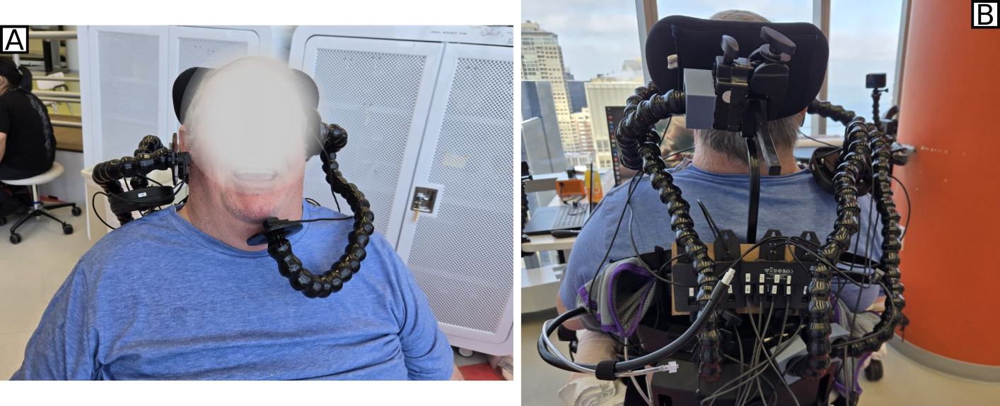
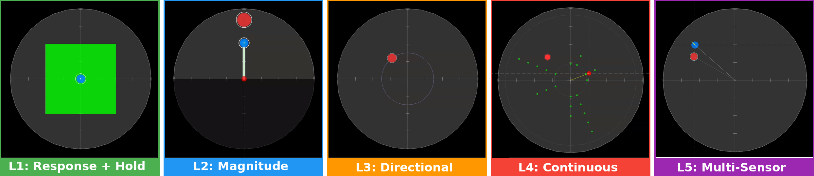
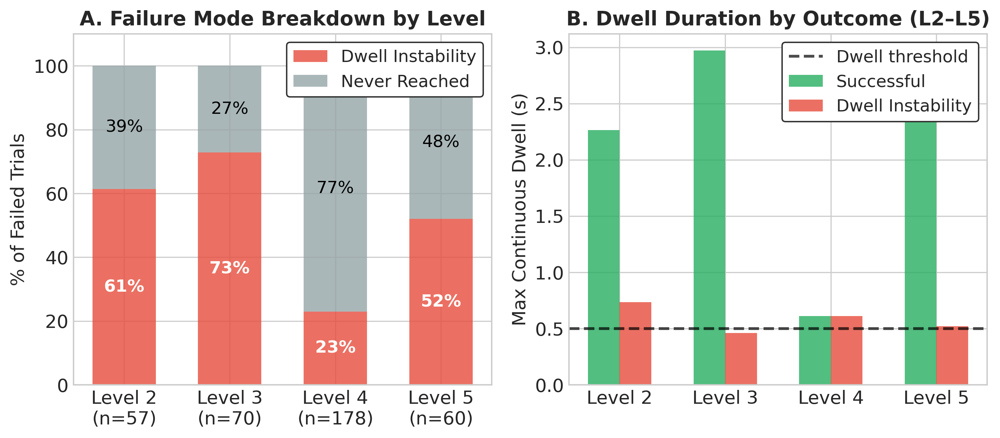
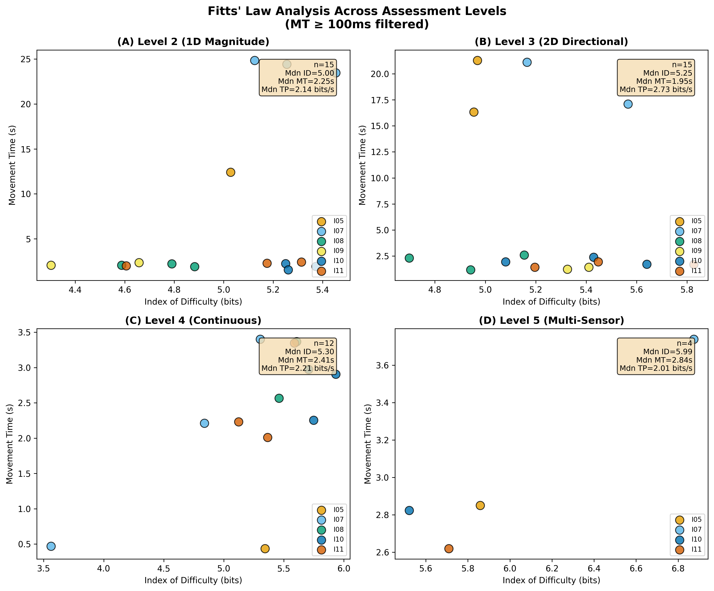
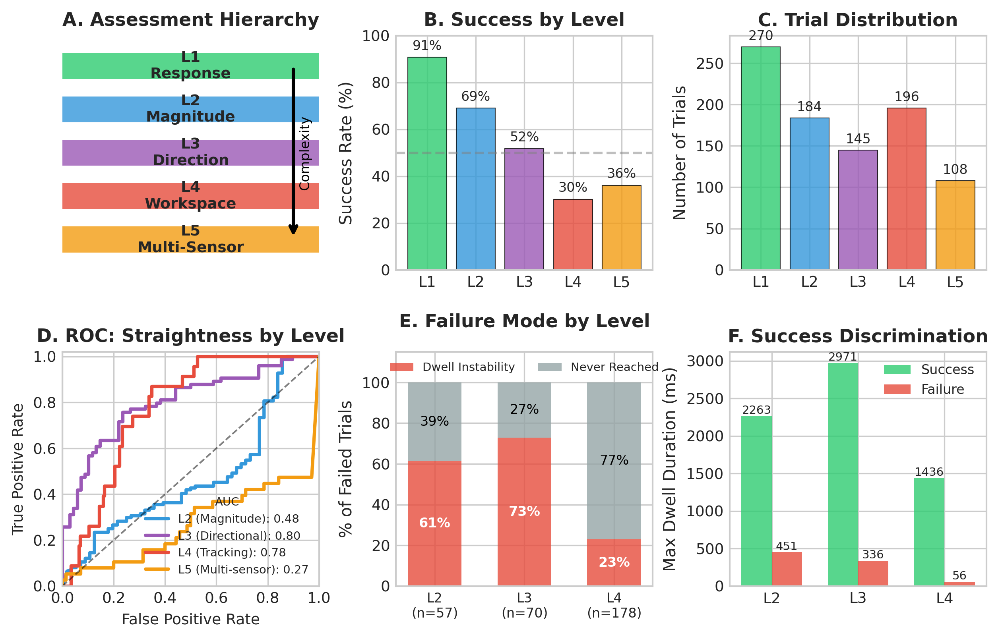

**A hierarchical assessment battery and fitting protocol for zero-force optical navigation sensors as an assistive-technology control interface**  
*Andrew Thompson, Brenna Argall | Northwestern University + Shirley Ryan AbilityLab*

**Published:** ACM UMAP 2026 (Late Breaking Report)

---

## Overview

Fitting an assistive technology (AT) interface to a person with severe motor impairment means finding which sensor placements and control configurations will produce functional control for that specific person. For most AT devices, this is done informally: a clinician tries a few options, observes the user, and makes a judgment call. When the configuration space is large, that process breaks down.

This project addresses that problem for a class of interface that had not previously been used for AT cursor control: optical navigation system (ONS) sensors. These sensors track surface motion via optical flow, the same sensing principle as a computer mouse, without contact force, without dedicated infrastructure, and without a force threshold to overcome. A user with no ability to generate sustained pressure can operate one. The downside is that the configuration space is large: sensors can be placed above any body site with residual motion, and each placement comes with an independently configurable signal processing pipeline.

To make that configuration space navigable, I designed a hierarchical five-level assessment battery that systematically evaluates each sensor-body-site pairing and produces scores that directly inform configuration decisions. The battery and interface were evaluated in a preliminary study with six participants with severe motor impairments (cervical SCI, ALS, dermatomyositis), across 16 sensor-body-site pairings.

*Participant I07 using the fitted ONS interface: a chin sensor (A) and right shoulder sensor (B) mounted on adjustable gooseneck arms, illustrating the non-contact, zero-force mounting approach.*

---

## The Interface

The hardware uses PixArt PAW3008J1 optical navigation sensors (50-3200 CPI, 24 in/s tracking, I²C, 2.5 mA) with integrated capacitive touch detection for hold-state recognition. Sensors mount in custom housings on flexible gooseneck arms, positioned above body sites with residual voluntary motion: chin, shoulder, cheek, temple, knee, elbow, and others across the six participants.

A custom C++/ROS2 system processes sensor signals through a seven-layer pipeline before mapping to control output: smoothing, gain, direction remapping, and thresholding are each configurable per sensor site. Control mapping options fall into three categories: *discrete positional* (contact-triggered output), *continuous* (proportional to sensor motion), and *direction-sensing* (output contingent on motion direction). Two formulations are tailored specifically to AT constraints: the halfspace mapping restricts the active output region to a single half-plane, enabling reliable unipolar proportional control from body sites with limited range of motion; the direction-sensing mapping converts analog motion into discrete directional outputs, providing multi-directional switching without dedicated switches.

Multi-sensor outputs are combined axis-by-axis, with discrete mappings taking priority over continuous ones.

---

## Assessment Battery

The battery has five levels, each targeting a distinct motor capability:

| Level | Name | Motor Capability Assessed |
|-------|------|--------------------------|
| 1 | Response + Hold | Binary response; sustained activation |
| 2 | Magnitude Control | 1D radial distance (variable distance, fixed direction) |
| 3 | Directional Control | 2D pointing (8 cardinal and intercardinal targets) |
| 4 | 2D Continuous | Free workspace coverage; signal quality under continuous movement |
| 5 | Multi-Sensor | Coordinated control of 2-3 sensors simultaneously |

Levels 1-4 are designed for broad applicability to continuous-control AT interfaces generally, beyond ONS sensors specifically. Level 1 uses dwell duration as its primary measure; Levels 2-3 and 5 use dwell-based target success (0.5 s on target); Level 4 advances targets on a fixed schedule and measures the fraction of cursor time-on-target. Assessment scores, composites of success rate, accuracy, and efficiency, combine with clinical partner observations and participant feedback to determine which control mapping each body site receives.

The battery produces failure mode profiles alongside pass/fail outcomes, distinguishing *why* a user struggles at a given level and directly informing configuration decisions.

*Assessment battery task displays (L1-L5): the software task interface at each battery level, rendered within the circular sensor workspace. Left to right: dwell on a full-field target (L1), radial reach to a 1D target (L2), 2D pointing to 8 directions (L3), continuous tracking of advancing targets (L4), and multi-sensor coordinated control (L5).*

---

## Results

### Task Discrimination

Success rates decreased with task complexity: L1: 92.6%, L2: 69.0%, L3: 51.7%, L4: 30.1%, L5: 36.1%. Each level discriminated its target capability:

- **L1:** Maximum continuous contact duration was 5.8x higher in successful than failed trials.
- **L2:** Movement path efficiency discriminated success from failure (Cohen's *d* = 0.53, *p* = 0.001).
- **L3:** Angular error showed strong discrimination (*d* = 1.44, *p* < 0.001); the L2 magnitude measure did not predict L3 success (*p* = 0.362), confirming directional control is a distinct capability.
- **L2/L3 independence:** Success rates were uncorrelated (ρ = 0.09, *p* = 0.87), the battery cannot be collapsed to a single screening task without losing information.

Movement straightness predicted success at L3 (AUC = 0.80) and L4 (AUC = 0.78) but not L2 (AUC = 0.48), and inverted at L5 (AUC = 0.28), distinguishing multi-sensor fitting requirements from single-sensor ones.

### Failure Mode Analysis

Failure modes split cleanly by task type. For discrete targeting (L2-3), dwell instability, reaching the target but failing to hold, dominated (61-73% of failures, *p* < 0.001). For continuous 2D tracking (L4), target reachability was the primary challenge: 77% of failures never entered the target zone. Multi-sensor coordination (L5) split roughly evenly between the two (52% vs. 48%).

This distinction matters for fitting: dwell-dominant failure sites benefit from stabilization support; reach-dominant sites need assistance covering the full workspace; multi-sensor sites need both addressed simultaneously.

*Failure mode analysis. Panel A: proportion of failures attributable to dwell instability vs. target never reached, across L2-L5. Panel B: maximum continuous dwell duration comparing successful trials to dwell-instability failures across levels, relative to the 0.5 s threshold.*

### Throughput Benchmarking

Fitts' Law throughput (computed via regression on movement time per ISO 9241-9 [2]) was measured across all levels and compared against published benchmarks for standard pointing devices [3]:

| Device / Level | Median TP (bits/s) | Force Required? |
|----------------|-------------------|----------------|
| Mouse | 4.3 | Yes |
| Trackball | 3.2 | Yes |
| Touchpad | 2.7 | Light |
| L2 (Magnitude) | 2.1 | **No** |
| L3 (Directional) | 2.7 | **No** |
| L4 (Continuous) | 2.2 | **No** |
| L5 (Multi-Sensor) | 2.0 | **No** |

Level 3 matched the touchpad numerically (both 2.7 bits/s), with no statistically significant difference (*t*(5) = -0.74, *p* = 0.50). The 26% throughput reduction at L5 relative to the best single-sensor level is modest given that participants were simultaneously coordinating 2-3 sensors. Performance varied 20x across participants and sites (0.21-4.28 bits/s), which is exactly why systematic multi-site evaluation is necessary.

*Fitts' Law analysis across all assessment levels: movement time vs. index of difficulty for each participant at each battery level (L2-L5), with median throughput annotations. Individual participants are color-coded; median regression lines are shown per level.*

### Wheelchair Driving Transfer

Four participants completed preliminary powered wheelchair driving trials using their fitted multi-sensor configurations. Motion co-activation (simultaneous signals from ≥2 sensors) was rare and comparable across driving and assessment contexts (2.6% vs. 2.5%), indicating that the fitted configurations did not produce runaway co-activation in real vehicle operation.

*Assessment battery summary: (A) battery hierarchy diagram, (B) success rates by level, (C) trial distribution, (D) ROC curves for movement straightness as a predictor across levels, (E) failure mode breakdown by level, (F) maximum dwell duration separating success from dwell-instability failure.*

---

## Citation

> Thompson, A., & Argall, B. (2026). A Zero-Force Optical Sensor Interface and Fitting Protocol for Customized Assistive Technology Control. In *Proceedings of the 34th ACM Conference on User Modeling, Adaptation and Personalization (UMAP '26)*. ACM. https://doi.org/10.1145/3774935.3812711

---

## References

[1] Wobbrock, J. O., Kane, S. K., Gajos, K. Z., Harada, S., & Froehlich, J. (2011). Ability-based design: Concept, principles and examples. *ACM Trans. Access. Comput.*, 3(3), 1-27.

[2] ISO 9241-9. (2000). *Ergonomic requirements for office work with visual display terminals (VDTs) — Part 9: Requirements for non-keyboard input devices*. International Organization for Standardization.

[3] MacKenzie, I. S., & Jusoh, S. (2001). An evaluation of two input devices for remote pointing. In *Proc. IFIP INTERACT*, 235-242.

[4] MacKenzie, I. S. (1992). Fitts' law as a research and design tool in human-computer interaction. *Human-Computer Interaction*, 7(1), 91-139.

[5] Lopresti, E. F., Dicianno, B. E., & Cooper, R. A. (2008). Accessibility and usability of computers for persons with disabilities. *Disability and Rehabilitation: Assistive Technology*, 3(1-2), 1-13.

[6] Soukoreff, R. W., & MacKenzie, I. S. (2004). Towards a standard for pointing device evaluation: Perspectives on 27 years of Fitts' law research in HCI. *International Journal of Human-Computer Studies*, 61(6), 751-789.

[7] Betke, M., Gips, J., & Fleming, P. (2002). The camera mouse: Visual tracking of body features to provide computer access for people with severe disabilities. *IEEE Trans. Neural Syst. Rehabil. Eng.*, 10(1), 1-10.
